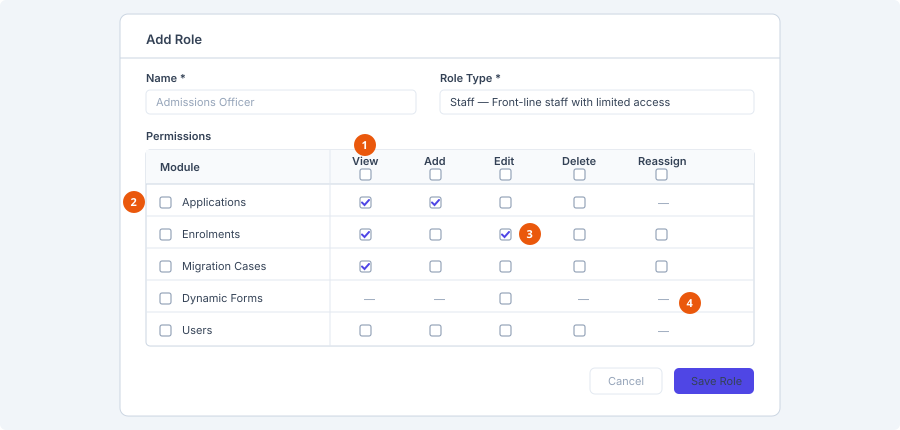

# Create a role

**Who can do this:** Admin
**Where:** Staff Portal → **Administration** → **Roles**
**Before you start:** Know which permissions the role needs — see the
[Permission matrix](../../reference/permission-matrix.md).

## The Roles screen

| Column | Shows |
|---|---|
| Name | |
| Description | |
| Role Type | A coloured badge. |
| Permissions | A count, for example *17 permission(s)*. |

Search the list with *Search role name…*. The list is paged server-side. An
empty list shows *No roles yet. Click "Add Role" to create one.*

**Add Role** appears top right only if your own role has the roles-add
permission.

## Add a role

1. Select **Add Role**. The **Add Role** dialog opens.
2. Complete the fields.
3. Select **Save Role**.

### Name

Required, maximum 50 characters. Name it after the job rather than the person —
*Admissions Officer*, not *Sarah*.

### Role Type

Required. This is the broad category the role belongs to, and it is separate
from the individual permissions below.

| Role Type | Description shown in the dropdown |
|---|---|
| Admin | Full administrative access |
| Manager | Manages finance and course promotions |
| Staff | Front-line staff with limited access |
| Student | Standard authenticated student |
| Customer | General customer (reserved for future visa module) |

Choosing **Admin** displays a warning: *Admin-type roles grant full
administrative access, including managing other roles and users.*

### Description

Optional, maximum 200 characters.

### Permissions

A grid: one row per module, one column per action.

1. **Column header checkbox** — grants that action across every module.
2. **Module checkbox** — grants every action for that one module.
3. **Cell checkbox** — one permission. Hover to see its key.
4. **Dash** — that module has no such action.

| Control | What it does |
|---|---|
| Checkbox in a column header | Selects that action for **every** module. |
| Checkbox beside a module name | Selects **every** action for that module. |
| Checkbox in a cell | Selects that one permission. Hover it to see the underlying permission key, such as `EnrolmentsEdit`. |
| **—** in a cell | That module has no such action. Configuration modules like Dynamic Forms have a single Edit key and nothing else. |

Columns are ordered View, Add, Edit, Delete, followed by any module-specific
actions such as Reassign and ViewAll.

::: tip Grant the minimum
Start from the smallest set that lets someone do their job and add more
when they ask. Taking access away later is harder than granting it.
:::

## Editing a role that is in use

If users already hold the role, the dialog opens with a notice: *N user(s)
currently have this role. Changes to its type or permissions apply to all of
them immediately.*

::: warning Immediately, but not to open sessions
The change is saved to all those users at once — but each of them only
picks it up the next time they sign in. See
[Assign permissions](../users/assign-permissions.md).
:::

## See also

- [Assign permissions](../users/assign-permissions.md)
- [Add a user](../users/add-a-user.md)
- [Permission matrix](../../reference/permission-matrix.md)
