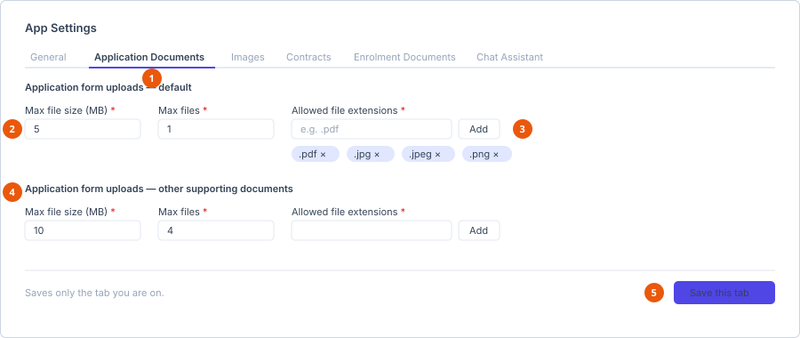

# App settings

**Who can do this:** Admin (`SettingsEdit`)
**Where:** Staff Portal → **Administration** → **App Settings**
**Before you start:** Nothing.

The screen is organised into six tabs. **Each tab saves independently** — the
save button applies only the tab you are on, so switching tabs before saving
loses your changes on the tab you left.

1. **Six tabs**, each saving on its own.
2. **Size and count limits** for that upload slot.
3. **Extensions are a list** — type one and select Add, rather than editing free text.
4. **Application Documents has two sets** — a default, and one for other supporting documents.
5. **Save** — applies to this tab only.

| Tab | Controls |
|---|---|
| General | Carousel counts and the application cap |
| Application Documents | Upload limits for student application documents |
| Images | Upload limits for images |
| Contracts | Upload limits for contracts |
| Enrolment Documents | Upload limits for enrolment documents |
| Chat Assistant | The visa Q&A chat widget and its AI providers |

## General

| Setting | Required | Effect |
|---|---|---|
| **Feedback carousel — default count** | Yes | How many feedback items the public carousel shows. |
| **Course promotions carousel — default count** | Yes | How many promotions the public carousel shows. |
| **Max applications per student** | Yes | The cap on how many applications one student may hold. |

## The four upload tabs

**Application Documents**, **Images**, **Contracts** and **Enrolment Documents**
all use the same three controls. Application Documents has two independent sets:
one **default**, applied to the required documents, and one for **other
supporting documents**.

| Setting | Required | Effect |
|---|---|---|
| **Max file size (MB)** | Yes | Rejects anything larger. |
| **Max files** | Yes | How many files may be attached in that slot. |
| **Allowed file extensions** | Yes, except on Enrolment Documents where it is optional | The accepted types. |

### Editing the extension list

Extensions are a list, not free text:

1. Type the extension in the box, including the leading dot — `.pdf`, `.png`.
2. Select the add button beside it.
3. Remove an extension with its own remove control.

Leaving the list empty where it is optional means no extension restriction is
applied.

::: info These are the limits students see
The size and extension text under each document on the application form is
read from here. If a student reports that a valid file is being rejected,
check this tab first. The application form falls back to 5 MB and
`.pdf, .jpg, .jpeg, .png` if it cannot load these settings.
:::

## Chat Assistant

Configures the visa Q&A chat widget and the AI providers behind it.

| Setting | Required | Effect |
|---|---|---|
| **System prompt** | Yes | The standing instruction given to the model on every conversation. This is what shapes the assistant's scope and tone. |
| **API URL** | Yes | The primary provider endpoint. |
| **Model** | Yes | The primary model identifier. |

Two fallback providers are configured underneath, each with its own **API URL**
and **Model**:

- **Fallback provider — Groq**
- **Fallback provider — OpenRouter**

These are used when the primary provider is unavailable, so the widget degrades
rather than failing outright.

::: warning Test after changing the system prompt
The system prompt governs what the assistant will and will not answer.
Change it, save, then ask the widget a few representative questions before
considering the change done.
:::

## Saving

Select the save button at the bottom of the tab. It saves **that tab only**.

## See also

- [Create an application](../../user/applications/create-an-application.md) — where the upload limits are enforced
