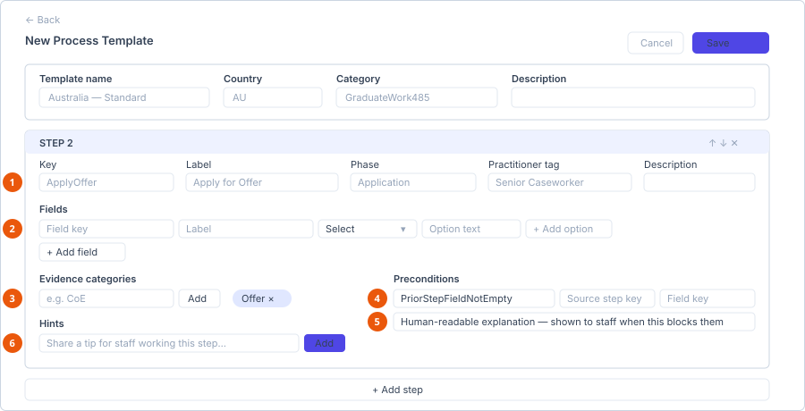

# Configure a visa process template

**Who can do this:** Admin (`VisaProcessTemplatesEdit`)
**Where:** Staff Portal → **Template** → **VISA Process Templates**
**Before you start:** Write out the steps in order, and know which practitioner
tag each belongs to. Building a template straight into the editor without that
list is slow and error-prone.

::: info One key covers two screens
`VisaProcessTemplatesEdit` gates both **VISA Process Templates** and
**Practitioner Tags**. The tag catalog is small and edited by the same
audience, so it does not have a separate permission.
:::

## What a template is for

A template defines an ordered process — the steps, what staff must record at
each one, what evidence must be uploaded, and what must be true before a step
can be completed. Staff then create **migration cases** from it, and each case
follows the template's steps. See
[Work a migration case](../../staff/migration-cases/work-a-migration-case.md).

## Create a template

Select **New Template**. The header buttons are **Cancel** and **Save
Template**.

### Template details

| Field | Notes |
|---|---|
| **Template name** | For example *Australia — Standard*. |
| **Country** | For example *AU*. |
| **Category** | For example *Student*, *GraduateWork485*, *Partner*. |
| **Description** | Free text. |

## Add steps

Select **+ Add step**. Each step has the following.

1. **Step identity** — key, label, phase, practitioner tag, description.
2. **Fields** — what staff record here. Select types get an option list.
3. **Evidence categories** — each must have a file before the step can complete.
4. **Preconditions** — the type decides which of the other boxes apply.
5. **The explanation** — what staff see when the rule blocks them. Never leave it blank.
6. **Hints** — tips for whoever works the step.

### Step identity

| Field | Notes |
|---|---|
| **Key** | The stable identifier, for example `ApplyOffer`. Referenced by preconditions and by form templates that bind to this step, so **avoid changing it once cases exist**. |
| **Label** | What staff see, for example *Apply for Offer*. |
| **Phase** | Groups steps together, for example *Application*. |
| **Practitioner tag** | Choose **No tag** or one from the practitioner tag catalog. |
| **Description** | Free text explaining the step. |

### Fields

The data staff record at this step. Select **+ Add field** for each.

| Setting | Notes |
|---|---|
| **Field key** | The identifier, referenced by preconditions on later steps. |
| **Label** | What staff see. |
| Input type | **Text**, **Date**, **Number**, **Select** or **YesNo**. |
| Options | For **Select** only. Add each option with **+ Add option**. |

### Evidence categories

The document categories that must be uploaded before the step can be completed.
Type a category — for example `CoE` — and select the add control.

Every category listed must have at least one matching document attached before
the step can be marked complete. Most steps need one; leave the list empty if a
step requires no evidence.

### Preconditions

Rules that must hold before a step can be completed. Select **+ Add
precondition** and choose a type:

| Type | Means |
|---|---|
| **PriorStepFieldNotEmpty** | A named field on an earlier step must be filled in. |
| **CourseApplicationFinalized** | A course application must have been finalised. |
| **FieldValueIn** | A named field's value must be one of a list of allowed values. |
| **AllPriorEvidenceUploaded** | Every earlier step's required evidence must be present. |

Depending on the type you also supply:

| Field | Used by |
|---|---|
| **Source step key** | Rules that point at an earlier step. |
| **Field key** | Rules that point at a specific field. |
| **Allowed value** | `FieldValueIn` — add each permitted value in turn. |
| **Human-readable explanation** | All types. |

::: tip Always write the explanation
The explanation is what staff see when a precondition blocks them. Without
it they get a rule they cannot act on. *"The CoE number must be recorded on
the CoE Completion step first"* saves a support call; a blank explanation
generates one.
:::

### Hints

Free-text tips for staff working the step. Type the hint and select **Add**, or
press <kbd>Enter</kbd>. Use these for the local knowledge that is not obvious
from the field labels.

## Save

Select **Save Template**. The template becomes available when staff create a
migration case.

## Changing a template that is in use

Step keys and field keys are referenced by preconditions and by form templates
bound to a step. Renaming a key breaks those references. Prefer adding a new
step or field over renaming an existing one once cases exist.

To retire a template, set it **Inactive** rather than deleting it — cases
already created from it are unaffected.

## See also

- [Work a migration case](../../staff/migration-cases/work-a-migration-case.md)
- [Create a form template](create-a-form-template.md) — forms can bind to a step key
