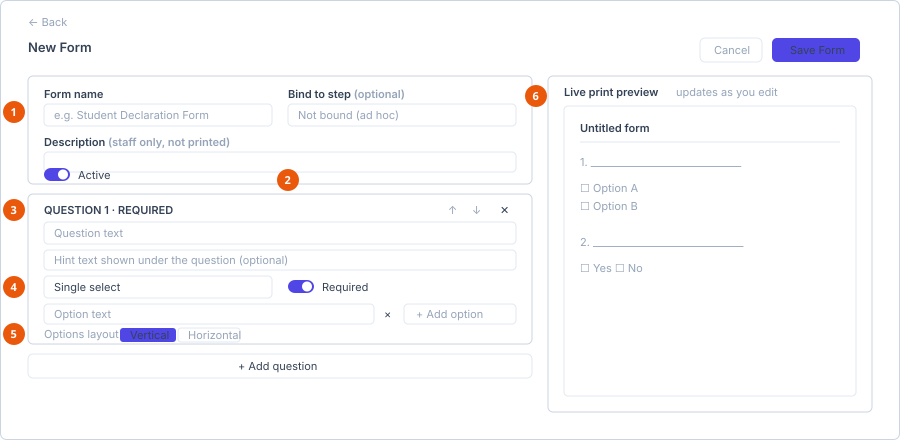

# Create a form template

**Who can do this:** Admin (`DynamicFormsEdit`)
**Where:** Staff Portal → **Template** → **Dynamic Forms**
**Before you start:** Have your questions written down. Composing them in the
builder is slower than typing them in from a list.

## The Dynamic Forms list

| Column | Shows |
|---|---|
| Form name | |
| Bound step | The step the form is tied to, or blank for an ad hoc form. |
| Questions | How many questions the form has. |
| Status | Active or Inactive. |

| Row button | When it appears |
|---|---|
| **Edit** | Always. |
| **Deactivate** | Only while the template is Active. |
| **Activate** | Only while the template is Inactive. |

There is no search box on this screen — the list is expected to stay small. An
empty list shows *No dynamic forms yet — click "New Form" to create one.*

## Create a form

Select **New Form**. The builder opens with the editor on the left and a live
preview on the right.

1. **Form details** — name, step binding and description.
2. **Active / Inactive** toggle.
3. **A question card** — headed *QUESTION n*, with move and delete controls.
4. **Answer type and Required**.
5. **Options and layout** — for select questions only.
6. **Live print preview** — updates as you type.

### Form details

| Field | Required | Notes |
|---|---|---|
| **Form name** | Yes | What staff and students see. For example *Student Declaration Form*. |
| **Bind to step** | No | Ties the form to a process step. Leave blank for an ad hoc form. |
| **Description** | No | Shown to staff only — it is **not** printed on the form. |
| **Active / Inactive** toggle | — | Defaults to Active. |

The status toggle carries the note: *Inactive forms can't be requested, but
past responses stay visible.*

### Binding to a step

**Bind to step** is a type-ahead offering the enrolment visa steps:

| Suggestion | Label |
|---|---|
| `StudentInfo` | Student Info |
| `EnrolmentForm` | Enrolment Form |
| `ApplyOffer` | Apply Offer |
| `CoeCompletion` | CoE Completion |
| `VisaApplication` | VISA Application |
| `VisaOutcome` | VISA Outcome |

The field is **not restricted to these**. The suggestions are the enrolment
steps, but you can type any migration-case process step key. Leaving it blank
makes the form ad hoc — staff request it manually rather than it appearing at a
step.

## Add questions

Select **Add question** at the bottom of the editor column. Each question card
is headed *QUESTION n*, and *· REQUIRED* is appended once you mark it required.

| Control | What it does |
|---|---|
| **Question text** | The question itself. |
| **Hint text** | Optional, shown in smaller text under the question. |
| Answer type dropdown | See the table below. |
| **Required** switch | Whether the student must answer. |
| ↑ / ↓ | Move the question up or down. Disabled at the ends. |
| ✕ | Delete the question. |

### Answer types

| Type | What the student sees | Extra settings |
|---|---|---|
| **Rich text** | A formatted text box. | **Max length (characters)**, defaulting to 5000. |
| **Yes / No** | Two options. | None. |
| **Single select** | Pick exactly one. | An option list. |
| **Multi select** | Tick any number. | An option list. |

### Option lists

For Single select and Multi select:

1. Select **+ Add option** and type the option text.
2. Select **×** beside an option to remove it.
3. Choose **Options layout** — **Vertical** or **Horizontal**. Horizontal suits
   short options like *Yes / No / Unsure*; vertical suits long ones.

## Preview and save

The right-hand column is a **live print preview** that updates as you type,
showing the form as it prints when blank. Use it to check spacing before you
save.

Select **Save Form** to save, or **Cancel** to discard.

## Changing a template that is already in use

Editing a template does **not** rewrite responses students have already
submitted — each response keeps a snapshot of the questions it was answered
against. Two consequences:

- Renaming a question does not change what past respondents saw. Their answers
  stay attached to the old wording.
- Adding a question does not retrospectively make old responses incomplete.

Prefer adding a new question over rewording an existing one when the meaning
changes, so historic answers stay readable.

To retire a form, use **Deactivate** rather than deleting it. Deactivating stops
new requests while leaving past responses intact.

## See also

- [Submit a form request](../../user/forms/submit-a-form-request.md) — the student's side
- [Configure a visa process template](configure-a-visa-process-template.md)
