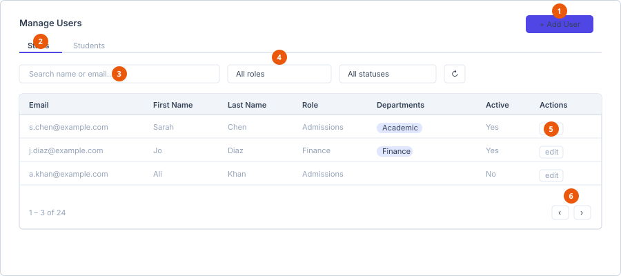

# Add a user

**Who can do this:** Admin
**Where:** Staff Portal → **Administration** → **Users**
**Before you start:** The role you want to give the user must already exist —
see [Create a role](../roles/create-a-role.md).

## The Users screen

Two tabs split the list: **Staffs** and **Students**.

1. **Add User** — opens the create dialog.
2. **Tabs** — Staffs and Students are separate lists.
3. **Search** — matches name or email.
4. **Role and status filters**.
5. **Row buttons** — edit a user.
6. **Pager** — the list is paged on the server.

### Table columns

| Column | Notes |
|---|---|
| Email | |
| First Name | |
| Last Name | |
| Role | Hidden on narrow phone screens. |
| Departments | Shown as badges. Hidden on laptop-width screens and below. |
| Active | *Yes* or *No*. Hidden on narrow phone screens. |
| Actions | Row buttons. |

### Finding a user

| Control | What it does |
|---|---|
| Search box | *Search name or email…* |
| Role dropdown | *All roles*, then one entry per role. |
| Status dropdown | *All statuses*, *Active only*, *Inactive only*. |
| Refresh | Reloads from the server. |
| Pager | The list is paged server-side. |

An empty list shows *No users yet. Click "Add User" to create one.*

## Add a user

1. Select **Add User**, top right. The **Add User** dialog opens.
2. Complete the fields below.
3. Select **Save User**.

### Fields

| Field | Required | Rules |
|---|---|---|
| **Email** | Yes | Must be a valid email address. Error: *A valid email is required*. |
| **Mobile** | Yes | Error: *Mobile is required*. |
| **Temporary Password** | Yes | At least 6 characters. Only shown when creating — not when editing. |
| **First Name** | Yes | Error: *First name is required*. |
| **Middle Name** | No | |
| **Last Name** | Yes | Error: *Last name is required*. |
| **Role** | Yes | Dropdown of existing roles. Error: *Role is required*. |

The temporary password field carries the note: *The user must change this
password the first time they log in.*

**Result:** The user appears in the list on the tab matching their role type,
and can sign in with the temporary password.

## Edit a user

Opening an existing user shows the same dialog titled **Edit User**, with two
differences:

- **Temporary Password** is not shown. Use the password reset flow instead.
- An **Active** checkbox appears.

The save button reads **Save Changes**.

## Deactivating instead of deleting

Clear the **Active** checkbox rather than deleting the user. A deactivated user
cannot sign in, but everything they created stays intact and correctly
attributed. Deleting is destructive and breaks that history.

## See also

- [Assign permissions](assign-permissions.md)
- [Create a role](../roles/create-a-role.md)
- [Manage departments](../departments/manage-departments.md)
