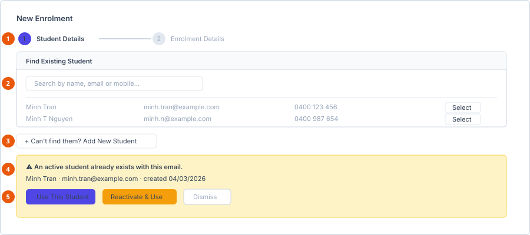
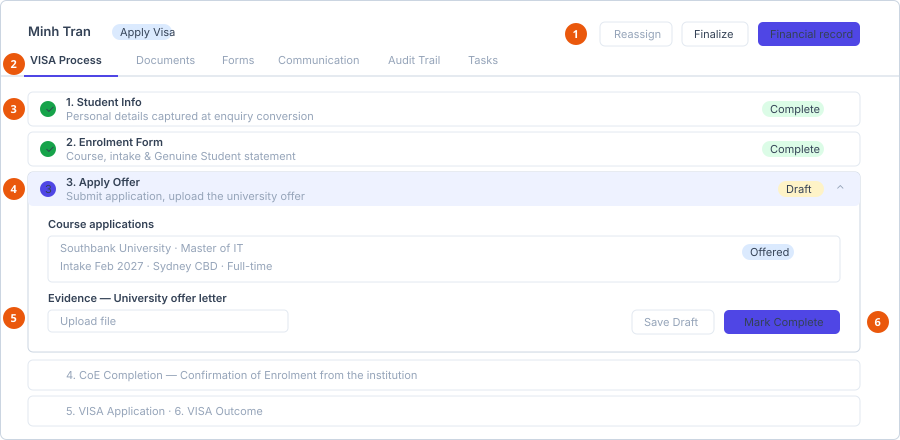

# Create an enrolment

**Who can do this:** Staff with `EnrolmentsAdd`
**Where:** Staff Portal → **Academic** → **Enrolments** → **New Enrolment**
**Before you start:** Know the student, the university and the course. Have the
student's details to hand in case they are not already in the system.

## The Enrolments list

| Column | Notes |
|---|---|
| Student | First and last name combined. |
| Email | Hidden on laptop-width screens and below. |
| Mobile | Hidden on tablet-width screens and below. |
| Status | A colour-coded badge. |
| Owner | The staff member responsible. |
| Created | `dd/MM/yyyy HH:mm`. |

The only row button is **View**.

## Create an enrolment

**New Enrolment** is a two-step wizard, shown as a progress indicator at the
top:

1. **Student Details**
2. **Enrolment Details**

1. **Two-step stepper** — student first, enrolment second.
2. **Search before anything else.**
3. **Add New Student** — only if the search genuinely finds nobody.
4. **Duplicate warning** — names the field that matched.
5. **Use This Student** / **Reactivate & Use** — almost always the right answer.

### Step 1 — find or create the student

Always search first.

1. Use **Find Existing Student** — *Search by name, email or mobile…*
2. Select the student from the results.

If there are no matches you see *No matching students. Try a different search,
or add a new student below.*

To add one, select **Can't find them? Add New Student**. The button toggles to
**Cancel Add New Student**. Fill in the student form — the same fields as
[Add a student](../students/add-a-student.md) — and submit.

Without student-search permission the panel is replaced by *You do not have
permission to search students.*

#### Duplicate detection

If the details you enter match someone already in the system, a warning appears
naming the field that matched:

| Situation | Message | Your options |
|---|---|---|
| An **active** student matches | *An active student already exists with this {field}.* | **Use This Student** — attach the enrolment to the existing record. |
| An **inactive (archived)** student matches | *An inactive (archived) student already exists with this {field}.* | **Reactivate & Use** — bring the archived record back and use it. |

Either way you can also **dismiss** the warning.

::: warning Take the duplicate warning seriously
Creating a second record for someone who already exists splits their
applications, enrolments and documents across two identities, and nothing
later joins them back up. **Use This Student** or **Reactivate & Use** is
almost always the right answer.
:::

Once a student is selected you can **change student** to go back, or edit their
details in place if you have the permission.

### Step 2 — enrolment details

Optional student fields you can complete here include **Middle name**,
**Gender** (*Female*, *Male*, *Non-binary*, *Prefer not to say*), the address
block (Street, Suburb, City, State, Postcode, Country) and an emergency contact
(Name, Relationship, Phone, Email).

The enrolment itself:

| Field | Required | Notes |
|---|---|---|
| **University** | Yes | The education partner. |
| **Course** | Yes | Filtered to the chosen university. |
| **Intake** | No | Options come from the selected course. |
| **Study mode** | No | Options come from the selected course. |
| **Campus** | No | Options come from the selected course. |
| **Commencement date** | No | |
| **Expected completion** | No | |
| **Notes** | No | |

Intake, study mode and campus are empty until you pick a course — they are read
from that course's configuration.

Use **Back** to return to step 1, or submit to create the enrolment.

**Result:** The enrolment is created with status **Draft** and appears in the
list with you as its owner.

## The enrolment detail screen

1. **Header buttons** — Reassign, Finalize and a link to the financial record.
2. **Tab bar** — six tabs.
3. **Completed steps** — collapsed, with a tick and a **Complete** pill.
4. **The open step** — only one expands at a time.
5. **Evidence upload** — required before the step can be completed.
6. **Save Draft / Mark Complete**.

Six tabs:

| Tab | Contains |
|---|---|
| **VISA Process** | The six-step process, described below. |
| **Documents** | Step evidence plus anything uploaded manually, and the invoices sent to the student — [Documents tab](../record-tabs/documents.md). |
| **Forms** | Dynamic forms requested from the student — [Forms tab](../record-tabs/forms.md). |
| **Communication** | Email to the student, education partner or business partner — [Communication tab](../record-tabs/communication.md). |
| **Audit Trail** | Who changed what, and when — [Audit Trail tab](../record-tabs/activity-log.md). |
| **Tasks** | Tasks linked to this enrolment — [Tasks tab](../record-tabs/tasks.md). |

The last five are shared with migration cases and financial records and behave
identically on all three.

Header buttons:

| Button | When it appears |
|---|---|
| **Reassign** | You have `EnrolmentsReassign`, or you own the enrolment and have `EnrolmentsEdit`. |
| **Finalize** | The enrolment is in a state that can be finalised. |
| A finance link | A financial record exists for the enrolment. |

## The six VISA process steps

| # | Step | Covers |
|---|---|---|
| 1 | Student Info | Personal details captured at enquiry conversion |
| 2 | Enrolment Form | Course, intake & Genuine Student statement |
| 3 | Apply Offer | Submit application, upload the university offer |
| 4 | CoE Completion | Confirmation of Enrolment from the institution |
| 5 | VISA Application | Lodge the student visa application |
| 6 | VISA Outcome | Final step — grant decision & study start |

Steps expand one at a time. A completed step shows a **Complete** pill and a
tick; work in progress shows a **Draft** pill.

Steps 3 to 6 are **gated** — each requires its evidence to be uploaded before it
can be completed. Any of these four can be **reopened** after completion if you
need to correct it. Steps 1 and 2 are already complete when the enrolment is
created.

::: info CoE Completion needs two evidence categories
Most steps require one document category before they can be marked
complete. CoE Completion requires two. If **Mark Complete** will not
engage, check that every listed category has at least one matching file.
:::

## See also

- [Add a student](../students/add-a-student.md)
- [Statuses](../../reference/statuses.md)
- [Record a commission](../finance/record-a-commission.md)
