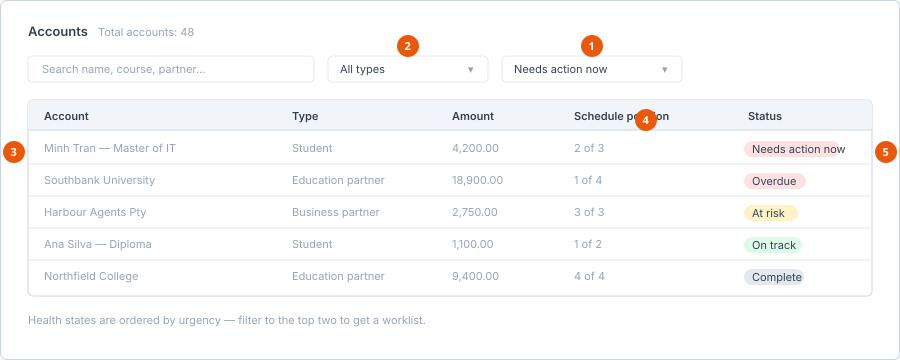

# Accounts and the timeline

**Who can do this:** Admin, Manager
**Where:** Staff Portal → **Finance** → **Accounts**

Where **Commission Records** shows one row per commissionable enrolment,
**Accounts** is the portfolio view — every account across students and partners,
with how healthy each one is.

## The Accounts screen

**Total accounts** is shown at the top.

1. **Status filter** — the fastest way to get a worklist.
2. **Type filter** — students, education partners or business partners.
3. **Account** — the student or partner the money relates to.
4. **Schedule position** — how far through its claim schedule the account is.
5. **Health state** — ordered by urgency, described below.

### Filters

| Control | Options |
|---|---|
| Search | *Search name, course, partner…* |
| **Type** | **All types**, **Students**, **Education partners**, **Business partners** |
| **Status** | **All statuses**, plus the health states below |

No matches shows *No accounts match these filters.*

### Columns

| Column | Shows |
|---|---|
| **Account** | The student or partner. |
| **Type** | Student, education partner or business partner. |
| **Amount** | The money involved. |
| **Schedule position** | Where the account sits in its claim schedule. |
| Status | The health state. |

### Health states

| State | Meaning | Action |
|---|---|---|
| **On track** | Claims are being made as scheduled. | Nothing. |
| **At risk** | Drifting — a claim is approaching without progress. | Look this week. |
| **Needs action now** | Something is due and nothing has happened. | Today. |
| **Overdue** | A claim date has passed unactioned. | Today, and find out why. |
| **Complete** | Finished. | Nothing. |

::: tip Filter to Needs action now first
The states are ordered by urgency for a reason. Filtering to **Needs action
now** and **Overdue** turns the whole finance module into a short worklist,
which is a far better start to the week than scrolling **Commission
Records** looking for problems.
:::

## Account Timeline

**Finance** → **Account Timeline** shows one account's movement over time:

| Line | Meaning |
|---|---|
| **Contract total** | The full value of the agreement. |
| **Received** | What has actually come in. |
| **Outstanding** | What is still owed. |
| **Next due** | The next scheduled claim. |
| **Schedule** | The full claim schedule. |

Use the timeline when the Accounts list flags a problem and you need to see
what happened on that account — the timeline shows the sequence, the
[commission record](record-a-commission.md) lets you act on it.

## See also

- [Record a commission](record-a-commission.md)
- [Manage partners](../partners/manage-partners.md)
