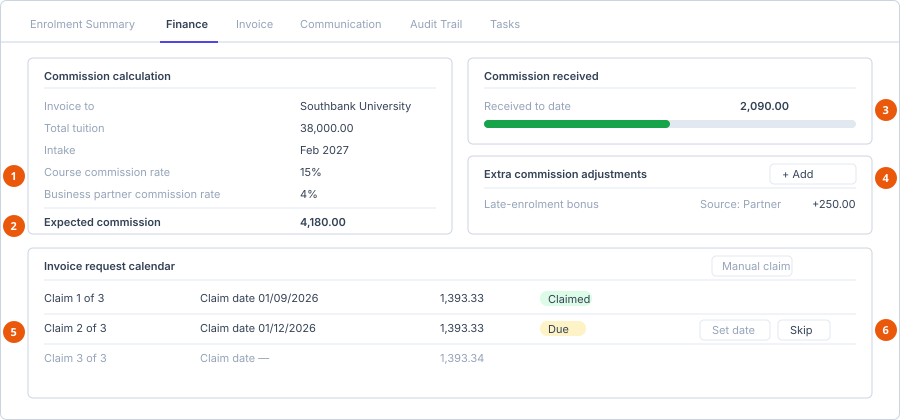

# Record a commission

**Who can do this:** Admin, Manager (`FinanceView`, `FinanceEdit`)
**Where:** Staff Portal → **Finance** → **Commission Records**
**Before you start:** The enrolment must exist, and the partner's commission
rate must be set — see [Manage partners](../partners/manage-partners.md).

## The Commission Records list

| Column | Shows |
|---|---|
| Student | |
| Enrolment Status | |
| Expected Commission | To two decimal places. |
| Invoices | How many invoices exist on the record. |

The only row button is **View**.

A financial record is created against an enrolment, so the list is effectively
one row per commissionable enrolment rather than something you create from
scratch.

## The record detail screen

Six tabs:

| Tab | Contains |
|---|---|
| **Enrolment Summary** | The enrolment this record belongs to. |
| **Finance** | The commission calculation and the claim schedule, described below. |
| **Invoice** | Invoices issued on this record. |
| **Communication** | Correspondence — [Communication tab](../record-tabs/communication.md). |
| **Audit Trail** | Who changed what, and when — [Audit Trail tab](../record-tabs/activity-log.md). |
| **Tasks** | Tasks linked to this record — [Tasks tab](../record-tabs/tasks.md). |

## The Finance tab

1. **Commission calculation** — read-only, derived from the course and partner rates.
2. **Expected commission** — the calculated total.
3. **Received to date** — what has actually come in.
4. **Extra commission adjustments** — bonuses and clawbacks, each with a source.
5. **Invoice request calendar** — the claim schedule.
6. **Set date and Skip** — skipping asks for an optional reason. Always write one.

### Commission calculation

Read-only figures showing how the expected commission was arrived at:

| Line | Meaning |
|---|---|
| **Invoice to** | Who the commission is claimed from. |
| **Total tuition** | The course tuition the calculation is based on. |
| **Intake** | The intake the enrolment is for. |
| **Course commission rate** | From the course on the education partner. |
| **Business partner commission rate** | From the business partner record. |
| **Expected commission** | The calculated total. |
| **Commission received** / **Received to date** | What has actually come in. |

::: info If the expected commission looks wrong, fix the source
The rate is read from the course and the partner, not typed here. A wrong
figure means a wrong rate on
[the partner or its course](../partners/manage-partners.md) — correcting it
there is the fix. Do not paper over it with an adjustment.
:::

### Extra commission adjustments

For amounts that fall outside the standard calculation — bonuses, clawbacks,
agreed variations. Each adjustment records its **Source**. Adding one requires
`FinanceEdit`.

### Invoice request calendar

The schedule of claims against this record. For each entry you can:

| Action | Notes |
|---|---|
| **Manual claim** | Raise a claim outside the schedule. |
| Set a **Claim date** | When the claim is to be made. |
| **Skip** | Opens *Skip {claim}?* with an optional **Reason**. Confirm, or choose **Keep claim**. |

Always write the reason when skipping. It is the only record of why an expected
claim was not made, and it is what an audit will ask about.

## Invoices

Invoices are issued from the **Invoice** tab using the templates configured in
[Manage invoice templates](../../admin/templates/manage-invoice-templates.md).

::: warning Which permission you need depends on the recipient
Sending, resending, cancelling or confirming an invoice is **not** checked
against `InvoiceTemplatesEdit`. The key required depends on who the invoice
is addressed to:

| Recipient | Key checked |
|---|---|
| Student | `EnrolmentsEdit` |
| Education partner, business partner, custom | `FinanceEdit` |

A colleague who can send partner invoices but not student ones is not
experiencing a fault — they have `FinanceEdit` without `EnrolmentsEdit`.
:::

## Related screens

| Screen | What it shows |
|---|---|
| **Accounts** | The aggregate finance view. Admin and Manager only. |
| **Account Timeline** | Movement over time. |

## See also

- [Manage partners](../partners/manage-partners.md)
- [Manage invoice templates](../../admin/templates/manage-invoice-templates.md)
- [Permission matrix](../../reference/permission-matrix.md)
