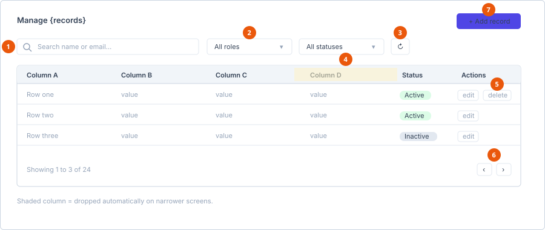

# Working with lists

Almost every management screen in the Staff Portal — Users, Roles, Enquiries,
Students, Enrolments, Migration Cases, Tasks, Partners, Commission Records —
uses the same list component. Learn it once and every screen behaves the same.

1. **Search** — matches only the fields named in the placeholder.
2. **Filters** — where the screen has them.
3. **Refresh** — reloads from the server.
4. **Shaded column** — dropped automatically as the window narrows.
5. **Row buttons** — vary by your permissions and the record's state.
6. **Pager** — appears only when there is more than one page.
7. **Add** — present only if you have the add permission.

## The controls

| Control | Notes |
|---|---|
| **Search** | The magnifier box at the top left. The placeholder tells you what it matches, and it differs per screen — *Search name or email…*, *Search role name…*, *Search by name, email or mobile…* Read it rather than guessing. |
| **Filters** | Dropdowns beside the search box, where a screen has them. Users has role and status; Enquiries uses tabs instead. |
| **Refresh** | The circular-arrow button. Reloads from the server. |
| **Pager** | Bottom right, showing *Showing {first} to {last} of {total}*. It appears only when there are more rows than fit on one page. |

## Search matches what the placeholder says

The search box does **not** search every column. It matches the fields named in
the placeholder. Searching a passport number in a box that says *Search name or
email…* returns nothing, and that is not a fault.

## Columns disappear on smaller screens

Columns are dropped progressively as the window narrows, so the table stays
readable rather than scrolling sideways. A column marked "hidden on laptop" is
gone below that width; "hidden on tablet" and "hidden on mobile" drop earlier
still.

If a colleague says a column is missing and you can see it, compare window
sizes before looking for anything else. Widening the browser, or collapsing the
sidebar with the control at its top, brings columns back.

## Row buttons appear conditionally

Two things decide which buttons a row shows:

- **Your permissions.** No delete permission, no Delete button.
- **The record's state.** A student's application shows Edit and Delete only
  while it is Pending; an active form template shows Deactivate, an inactive one
  shows Activate.

A missing button is almost always one of those two, not an error.

## Paging is on the server

For most screens, moving between pages fetches from the server, and search and
filters are applied there too. Two consequences:

- Searching looks across **all** records, not just the page you can see.
- The row count in the pager is the true total.

A few small screens load everything at once and filter in the browser instead —
the student's own application list and the Dynamic Forms list, both of which are
inherently small.

## See also

- [Portal tour](../user/getting-started/portal-tour.md)
- [Permission matrix](../reference/permission-matrix.md)
