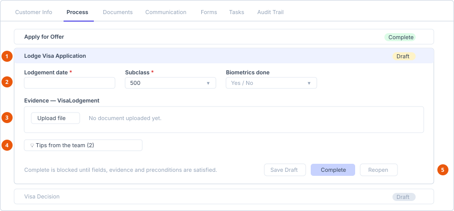

# Work a migration case

**Who can do this:** Staff with `MigrationCasesView`; starting a case needs
`MigrationCasesAdd`, working it needs `MigrationCasesEdit`
**Where:** Staff Portal → **Migration Cases**
**Before you start:** An **active** visa process template must exist for the
category — see
[Configure a visa process template](../../admin/templates/configure-a-visa-process-template.md).

A migration case is a real matter running on one of your process templates, for
any visa category.

## The list

| Column | Notes |
|---|---|
| Case # | The case reference. |
| Contact | The primary contact's name. |
| Category | From the template. |
| Country | Hidden on laptop-width screens and below. |
| Template | Which template the case was started from. Hidden on laptop-width screens and below. |

An empty list shows *No cases yet — click "Start Case" to begin one from a
template.*

## Start a case

1. Select **Start Case**. The start panel opens above the list.
2. Choose the **Template**. Entries read *Name — Country/Category*. Only
   **active** templates are offered; if the list is empty it shows *Loading
   active templates…*
3. Enter the **Primary contact name**, **Contact email** and **Contact
   mobile**.
4. Add **Notes** if useful — a rich-text field.
5. Select the create button.

**Result:** The case is created with its own case reference, and its steps are
copied from the template.

::: warning The case takes a snapshot of the template
The steps, fields, evidence categories and hints are copied onto the case
when it is created. Editing the template afterwards does **not** change
cases that already exist. That is deliberate — a case in flight keeps the
process it started under.
:::

## The case detail screen

Seven tabs:

| Tab | Contains |
|---|---|
| **Customer Info** | The contact's personal details. |
| **Process** | The steps. This is where the work happens. |
| **Documents** | Step evidence plus manual uploads — [Documents tab](../record-tabs/documents.md). Cases have no invoices section; enrolments do. |
| **Communication** | Correspondence — [Communication tab](../record-tabs/communication.md). |
| **Forms** | Dynamic forms requested from the contact — [Forms tab](../record-tabs/forms.md). |
| **Tasks** | Tasks linked to this case — [Tasks tab](../record-tabs/tasks.md). |
| **Audit Trail** | Who changed what, and when — [Audit Trail tab](../record-tabs/activity-log.md). |

The header shows the contact's name and the case **Status** as a badge.

### Customer Info

| Field |
|---|
| Full name, Middle name, Date of birth |
| Email, Mobile, Gender, Nationality, Passport number |
| Hometown address |
| Current address |
| Emergency contact |

Select the save button at the bottom to store changes. It is disabled if you
cannot manage the case.

## Work the Process tab

Each step shows its **label** and a **status badge**. Expand a step to work it.

1. **The open step** — its status badge shows Draft until completed.
2. **Fields** — from the template. Required ones are marked \*.
3. **Evidence** — one upload area per required category.
4. **Tips from the team** — hints left by whoever built the template.
5. **Step buttons** — Save Draft, Complete, Reopen.

### Fields

The step's fields come from the template. Required fields are marked with \*.
Input types are Text, Date, Number, Select (a dropdown of the template's
options) or Yes/No.

All inputs are disabled unless the step is editable — a completed step is
read-only until you reopen it.

### Evidence

Each required evidence category gets its own upload area, labelled with the
category name, with an **Upload file** control. Every category listed must have
at least one file before the step can be completed.

### Tips from the team

If the template's step carries hints, a **Tips from the team (n)** toggle
appears. Expand it for the guidance whoever configured the template left for
whoever works the step.

### Step buttons

| Button | What it does |
|---|---|
| **Save Draft** | Saves your field values without completing the step. |
| **Complete** | Marks the step complete. Requires the step's fields and evidence, and any preconditions to be satisfied. |
| **Reopen** | Puts a completed step back into edit so you can correct it. |

::: info If Complete will not engage
Work through these in order:

1. Every required field on the step is filled in.
2. Every listed evidence category has at least one uploaded file.
3. The step's preconditions are satisfied — these usually point at an
   **earlier** step, so the blocker is often not on the step you are
   looking at.

The explanation text configured on the precondition tells you which. If it
is blank, whoever built the template did not write one — see
[Configure a visa process template](../../admin/templates/configure-a-visa-process-template.md).
:::

## Reassigning a case

Cases support reassignment via `MigrationCasesReassign`, the same shape used by
enrolments.

## See also

- [Configure a visa process template](../../admin/templates/configure-a-visa-process-template.md)
- [Create an enrolment](../enrolments/create-an-enrolment.md) — the enrolment side runs a fixed six-step version of the same idea
