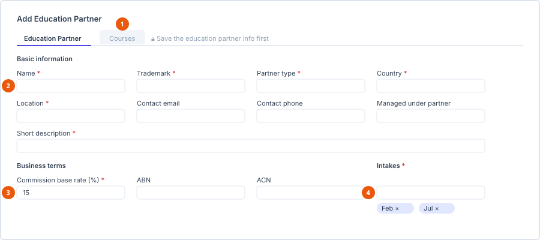

# Manage partners

**Who can do this:** Staff with `EducationPartnersView` / `BusinessPartnersView`,
plus the matching Add/Edit/Delete keys
**Where:** Staff Portal → **Partners**
**Before you start:** Have the partner's ABN/ACN and commission rate agreed.

Eduflex keeps two separate registers. They are not interchangeable.

| Register | Use it for | Drives |
|---|---|---|
| **Education Partners** | Institutions whose courses you place students into. | The University and Course dropdowns on applications and enrolments. |
| **Business Partners** | Agents and other commercial relationships. | Commission records. |

---

## Education Partners

Adding one is a two-tab process: **Education Partner** first, then **Courses**.

1. **Courses tab, locked** — *Save the education partner info first*.
2. **Basic information** — the starred fields are required.
3. **Commission base rate** — the default a course can override.
4. **Intakes** — a list, added one at a time.

::: info The Courses tab is locked until you save
It is disabled while the partner is unsaved, with the tooltip *Save the
education partner info first*. Complete and save the partner details before
you try to add courses.
:::

### Tab 1 — Education Partner

**Basic information**

| Field | Required |
|---|---|
| Logo | No |
| **Name** | Yes |
| **Trademark** | Yes |
| **Partner type** | Yes |
| **Country** | Yes |
| **Location** | Yes |
| Contact email | No |
| Contact phone | No |
| **Short description** | Yes |
| Managed under partner | No — nests this partner beneath another |

**Business terms**

| Field | Required |
|---|---|
| **Commission base rate (%)** | Yes |
| ABN | No |
| ACN | No |

**Intakes**

| Field | Required |
|---|---|
| **Intakes** | Yes |

The partner-level intakes are the default offered to its courses.

### Tab 2 — Courses

Add each course the partner offers. The panel header reads **Add Course**, or
**Update Course** when editing an existing one.

| Field | Required |
|---|---|
| **Course name** | Yes |
| **Tuition fee (per annum)** | Yes |
| **Total course tuition** | Yes |
| **Currency** | Yes |
| Course duration (months) | No |
| **Commission base rate (%)** | Yes |
| **Intakes** | Yes |
| Study modes | No |
| Campuses | No |

::: warning Courses feed the enrolment wizard
**Intakes**, **Study modes** and **Campuses** entered here are exactly what
staff see in those dropdowns on
[Create an enrolment](../enrolments/create-an-enrolment.md). If a colleague
reports that a course has no intake options, it is because none were
entered on the course — not a fault.

The course commission rate overrides the partner-level rate for that
course.
:::

---

## Business Partners

A single form, in three sections.

### Basic information

| Field | Required |
|---|---|
| **Name** | Yes |
| Trademark | No |
| Address | No |
| **Contact email** | Yes |
| Contact phone | No |
| **Commission base rate (%)** | Yes |
| ABN | No |
| ACN | No |

### Contract

| Field | Notes |
|---|---|
| Contract start | |
| Contract end | |
| Contract file | Upload the signed agreement. Limits come from the **Contracts** tab of [App settings](../../admin/settings/app-settings.md). |

### Contacts

A repeating list of individual people at the partner:

| Field | Required |
|---|---|
| **First name** | Yes |
| **Last name** | Yes |
| **Email** | Yes |
| Contact no | No |

Add as many as you deal with. This is what stops correspondence going to a
generic mailbox.

## See also

- [Create an enrolment](../enrolments/create-an-enrolment.md)
- [Record a commission](../finance/record-a-commission.md)
