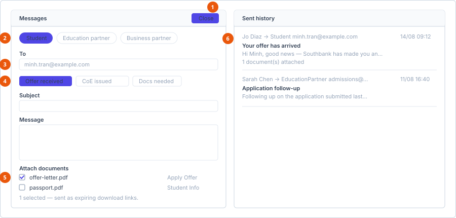

# Communication tab

**Where:** The **Communication** tab on an enrolment, a migration case or a
financial record.

Two panels side by side: **Messages** on the left for composing, **Sent
history** on the right.

1. **+ Compose** — becomes **Close** while the form is open.
2. **Recipient chips** — selecting one fills in the address below.
3. **To** — prefilled, but editable for a one-off.
4. **Template buttons** — fill the subject and message.
5. **Attach documents** — sent as expiring links, not files.
6. **Sent history** — the only record of contact Eduflex keeps.

## Sent history

Every email sent from the record, newest at the top. Each entry shows who sent
it, the recipient type, the address, the date, the subject, the first 140
characters of the body, and how many documents were attached.

Empty, it reads *No emails sent yet.*

This is the record of contact. Nothing else in Eduflex keeps it, so send from
here rather than from your own mail client if you want the history to exist.

## Compose an email

Select **+ Compose**. The button becomes **Close** while the form is open. It
only appears if you have permission to compose on that record.

### 1. Choose the recipient type

Chips across the top of the form. On an enrolment the intro reads *Compose a
message to the student, the education partner, or a business partner.*
Selecting a chip fills in the **To** address for you and may show a short
information strip about that recipient.

### 2. Check the address

**To** is prefilled from the recipient type and is editable — change it for a
one-off without altering the underlying record.

### 3. Apply a template (optional)

Buttons for each available email template. Selecting one fills the **Subject**
and **Message**. The selected template is highlighted.

Templates are managed at
[Manage email templates](../../admin/templates/manage-email-templates.md). If a
template you expect is missing, it has been deactivated.

### 4. Write the message

**Subject** and **Message**. Edit freely after applying a template — the
template is a starting point, not a lock.

### 5. Attach documents (optional)

A checklist of the documents on the record, each showing its file name and the
category it came from. Tick what you need. A summary line appears:

> *N selected — sent as expiring download links, not raw attachments.*

::: warning Attachments are links, and they expire
Recipients get time-limited download links, not files attached to the
email. Two consequences worth knowing:

- A recipient who sits on the email for a long time may find the link dead
  and have to ask again.
- Anyone who receives a forwarded copy can use the link while it is alive.
  Think before attaching something sensitive to a message going to a
  partner.
:::

### 6. Send

**Send email**. The button shows *Sending...* while it works, and stays
disabled until the message has everything it needs.

## See also

- [Documents tab](documents.md) — what appears in the attachment list
- [Manage email templates](../../admin/templates/manage-email-templates.md)
