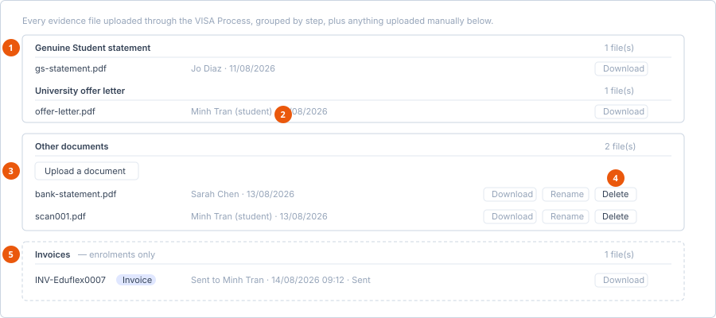

# Documents tab

**Where:** The **Documents** tab on an enrolment, a migration case or a
financial record.

The same tab is used on all three, so it behaves identically wherever you meet
it.

1. **Step evidence groups** — read-only here, uploaded on the step itself.
2. **(student)** — marks a file the applicant provided rather than a colleague.
3. **Upload a document** — the only upload on this tab.
4. **Rename and Delete** — manageable records only; Download is always available.
5. **Invoices** — enrolments only. Migration cases have no invoicing.

## What it shows

The intro line on an enrolment reads: *Every evidence file uploaded through the
VISA Process, grouped by step, plus anything uploaded manually below.*

That is the key point — **you do not upload step evidence here**. Documents
attached to a process step are uploaded on the step itself, and appear here
read-only, grouped under their category. The category sections show *No
document uploaded yet.* when empty.

## Other documents

Below the category groups is a free section for anything that does not belong
to a step. This is the only part of the tab you can upload into.

| Control | What it does |
|---|---|
| **Upload a document** | Attaches a file to the record. |
| **Download** | Opens the file in a new tab. |
| **Rename** | Edits the display name in place. **Save** or **Cancel**. |
| **Delete** | Removes the document. |

Upload, Rename and Delete appear only if you can manage the record. Everyone
who can see the tab can Download.

Each file lists who uploaded it and when. Files that came from the student are
marked **(student)** after the uploader's name — useful when you are checking
whether the applicant or a colleague provided something.

While a file is uploading, *Uploading…* appears under the upload control.

Empty section text is *No other documents yet.*

## Invoices (enrolments only)

Enrolments have an extra **Invoices** section below the other documents, listing
every invoice sent to the student for that enrolment. Migration cases do not
have this — they have no invoicing.

Each row shows the invoice number with an **Invoice** badge, then *Sent to
{recipient} · {date} · {status}*. A **Download** button appears when a PDF
exists.

## Renaming, and why to do it

Files arrive named whatever the sender called them — `scan001.pdf`,
`IMG_4471.jpg`. Renaming them to something meaningful is worth the five seconds:
the names are what appear in the **Attach documents** list when someone composes
an email from the [Communication tab](communication.md), and picking the right
attachment from a list of `scan001.pdf` is guesswork.

## See also

- [Forms tab](forms.md) — exported form PDFs land in Documents
- [Communication tab](communication.md) — documents can be attached to emails
