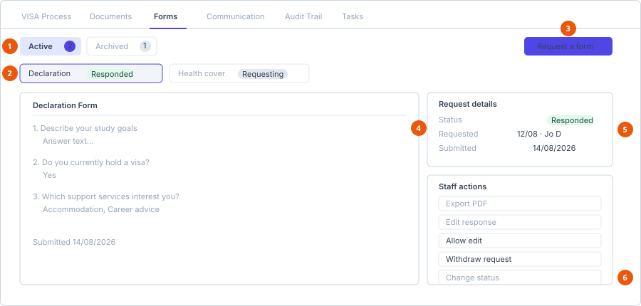

# Forms tab

**Where:** The **Forms** tab on an enrolment or a migration case.
**Before you start:** An **active** form template must exist — see
[Create a form template](../../admin/templates/create-a-form-template.md).

This is where staff request forms from a contact and manage the responses.

## Layout

1. **Scope tabs** — Active and Archived, each with a count.
2. **One button per form**, carrying its status badge.
3. **Request a form** — only if you can manage the record.
4. **The response** — printed view, or the editor while you are editing.
5. **Request details** — who requested it, when, and when it was submitted.
6. **Staff actions** — the buttons shown depend on the current status.

Empty, it reads *No forms have been requested yet.*

Once forms exist, three levels of navigation stack up:

1. **Scope tabs** — **Active** and **Archived**, each with a count.
2. **A button per form**, showing the form name and its status badge.
3. The selected response fills the rest of the tab: the answers on the left,
   **Request details** and **Staff actions** on the right.

If a scope has nothing in it you see *No active form requests.* or *No archived
form requests.*

## Request a form

1. Select **Request a form**.
2. Choose the form from the **Form** dropdown — active templates only.
3. Select **Request**.

**Result:** The response is created at status **Requesting** and the contact can
complete it. See
[Submit a form request](../../user/forms/submit-a-form-request.md).

## Request details

Read-only facts about the response:

| Line | Shown |
|---|---|
| Status | The status badge. |
| Requested | Date and the staff member who requested it. |
| Submitted | Once the contact submits. |
| Withdrawn | If it was withdrawn. |
| Bound step | If the form template is tied to a process step. |

## Staff actions

Available only if you can manage the record.

| Action | When it appears | What it does |
|---|---|---|
| **View saved PDF (in Documents)** | An export already exists | Jumps to the exported PDF on the [Documents tab](documents.md). |
| **Export PDF** | Always | Generates a PDF of the response and saves it to Documents. |
| **Edit response** | Always | Opens the answers for editing by you. |
| **Allow edit** | Status is **Responded** | Reopens the form so the contact can change their answers. |
| **Withdraw request** | Status is **Requesting** or **Draft** | Recalls a form the contact has not completed. |
| **Archive** | Status is **Withdrawn** | Moves it to the Archived scope. |
| **Change status** | Always | Manual override — see the warning below. |

Withdraw, Archive and Allow edit each ask you to confirm.

### Editing a response as staff

Selecting **Edit response** replaces the printed view with **Editing answers**.
Save with **Save changes**, or discard with **Cancel**.

On enrolments, staff cannot submit on the contact's behalf — there is a save
but no submit. Editing changes the recorded answers; it does not sign them off
as the contact's own submission.

### Change status — use it last

The override dialog carries its own warning:

> Manual override — doesn't validate or regenerate the PDF. Prefer
> Withdraw/Archive/Allow-edit where they apply; use this to fix a form stuck in
> the wrong status.

::: warning It skips everything
**Change status** writes the status directly. It does not check that the
transition makes sense, and it does not regenerate the exported PDF — so
the saved PDF and the recorded status can disagree afterwards. Reach for
**Allow edit**, **Withdraw** or **Archive** first, every time. Use the
override only to rescue a form that is genuinely stuck.
:::

## Statuses

| Status | Meaning |
|---|---|
| **Requesting** | Sent, not yet started by the contact. |
| **Draft** | The contact has saved answers but not submitted. |
| **Responded** | Submitted and locked to the contact. |
| **Withdrawn** | Recalled before completion. |
| **Archived** | Retained, no longer active. |

## See also

- [Create a form template](../../admin/templates/create-a-form-template.md)
- [Documents tab](documents.md)
- [Submit a form request](../../user/forms/submit-a-form-request.md) — the contact's view
