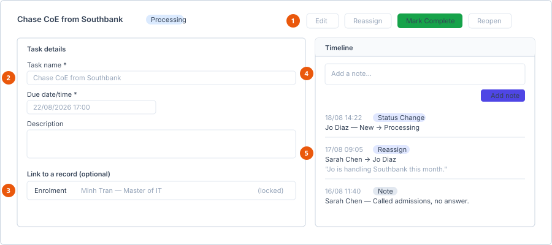

# Manage tasks

**Who can do this:** All staff (`TasksView` / `TasksAdd` / `TasksEdit`); **All
Tasks** additionally needs `TasksViewAll`
**Where:** Staff Portal → **Tasks**
**Before you start:** Nothing.

## Two lists

| Menu item | Shows | Who sees it |
|---|---|---|
| **My Tasks** | Tasks where you are the assigner or the assignee. | Every staff member. |
| **All Tasks** | Tasks across your department. | Manager and Admin only, via `TasksViewAll`. |

A Staff-level member never sees tasks that are not theirs.

## Create a task

1. In the sidebar, select **Tasks**, then **New Task**.
2. Complete **Task details**.
3. Optionally link the task to a record.
4. Save.

### Task details

| Field | Required | Notes |
|---|---|---|
| **Task name** | Yes | |
| **Assignee** | Yes | Dropdown of staff members. |
| **Due date/time** | Yes | Date **and** time, not just a date. |
| **Description** | No | |

### Link to a record

Optional. A task can be linked to a record so whoever picks it up has the
context without hunting for it. Four types are supported:

| Type | Picker title |
|---|---|
| Enrolment | *Select an Enrolment* |
| Enquiry | *Select an Enquiry* |
| Financial record | |
| Migration case | |

Select **Link _type_** to open the picker, and **Remove** to clear a link. When
you create a task from inside a record, that link is pre-set and locked — the
**Remove** control is hidden for it.

**Result:** The task appears in the assignee's **My Tasks** and they are
notified.

## Work a task

Open a task from either list. What you can do depends on your relationship to
it, not only on your permissions.

1. **Header buttons** — which appear depends on whether you are the assigner or
   the assignee.
2. **Task details** — editable by the assigner while the task is open.
3. **Record link** — locked when the task was created from a record.
4. **Add a note** — the button stays disabled until you type something.
5. **Timeline** — notes, status changes and reassignments, newest first.

| Button | Available to |
|---|---|
| **Edit** | The **assigner**, while the task is not Completed. |
| **Reassign** | The assigner **or** the assignee. |
| **Mark Complete** | The assigner or the assignee, while the status is not Completed. |
| **Reopen** | The assigner or the assignee, once it is Completed. |

::: info Permission gets you in, ownership decides what you can do
`TasksView` / `TasksAdd` / `TasksEdit` let you use the Tasks feature at all.
What you can do to a *specific* task is then an ownership check — are you
its assigner or its current assignee. There are no separate permission keys
for responding, noting, reassigning or completing.

This is the same split used elsewhere in Eduflex, for example on enrolments.
:::

### Editing

Only the assigner can edit, and only while the task is open. The editable
fields are **Task name**, **Due date/time**, **Description** and the record
link. The assignee is changed through **Reassign**, not here.

### Reassigning

1. Select **Reassign**.
2. Choose the **New assignee**.
3. Write a **Note** explaining why — *Why is this being reassigned?* Required.

**Result:** The task moves to the new assignee, and the reassignment is recorded
on the timeline with your note.

### Completing and reopening

**Mark Complete** sets the status to Completed. **Reopen** puts it back. Both
are available to the assigner and the assignee.

## Timeline

Every task has a timeline, newest first, recording three kinds of entry:

| Entry | Added when |
|---|---|
| **Note** | Someone writes one. |
| **Status Change** | The task is completed or reopened. |
| **Reassign** | The task changes assignee. |

Add a note with the rich-text box at the top of the timeline. The add button
stays disabled until you type something.

## Statuses

| Status | Meaning |
|---|---|
| **New** | Created and assigned, not yet started. |
| **Processing** | The assignee is working on it. |
| **Completed** | Finished. |

## See also

- [Manage departments](../../admin/departments/manage-departments.md) — department membership scopes **All Tasks**
- [Permission matrix](../../reference/permission-matrix.md)
