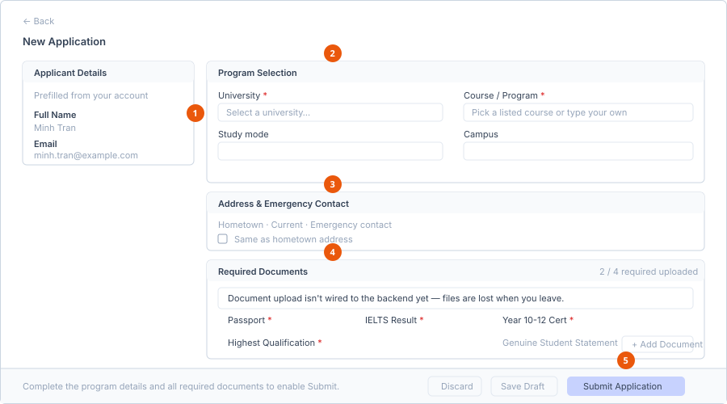

# Create an application

**Who can do this:** Student
**Where:** Student Portal → **Application** → **New Application**
**Before you start:** Have your passport, IELTS result, Year 10–12 certificate
and highest qualification ready as files. You cannot submit without all four.

::: warning You can only have one application open at a time
The **New Application** button is disabled while you have an application at
**Pending** or **Approved**. Hovering it shows: *Finish or wait on your
current application before starting another.* A new application is allowed
again once the existing one is **Rejected** (you are free to try elsewhere)
or **Studying** (staff have enrolled you).
:::

## The screen

The page is split into a narrow left column and a wide right column.

1. **Applicant Details** — read-only, from your account.
2. **Program Selection** — the university, course and description.
3. **Address & Emergency Contact** — saved on this application, not your account.
4. **Required Documents** — with the running *2 / 4 required uploaded* count.
5. **Sticky action bar** — Discard, Save Draft and Submit Application.

**Left column — Applicant Details**

Your full name, email and application date, prefilled from your account and not
editable here. To change them, go to **Profile** — see
[Complete your profile](../profile/complete-your-profile.md).

**Right column — three cards you fill in**

1. Program Selection
2. Address & Emergency Contact
3. Required Documents

A sticky action bar sits at the bottom of the screen with the buttons.

## Step 1 — Program Selection

| Field | Required | Notes |
|---|---|---|
| **University** | Yes | Dropdown of the education partners your provider works with. |
| **Course / Program** | Yes | Type-ahead. Pick a listed course or type your own — it is a free-text field with suggestions, not a fixed list. |
| **Study mode** | No | Suggestions such as *Full-time*. You can type your own. |
| **Campus** | No | Suggestions such as *Sydney CBD*. You can type your own. |
| **Description** | Yes | Free text. Describe the program, the intake, and why you are applying. |

Only **University**, **Course / Program** and **Description** are checked before
you can submit. Study mode and campus are optional.

## Step 2 — Address & Emergency Contact

These are saved against **this application**, not your account, because they
describe your situation at the time you applied.

**Hometown Address** — Street, Suburb, City, State, Postcode, Country.

**Current Address** — the same six fields. Tick **Same as hometown address** to
copy the hometown values across and lock the fields; untick it to enter a
different address.

**Emergency Contact** — Name, Relationship, Phone, Email.

None of these fields block submission, but staff will chase you for them.

## Step 3 — Required Documents

The card header shows a running count, for example *2 / 4 required uploaded*.

**Required now** — all four must be attached before **Submit Application**
becomes available:

| Document | Files | Type |
|---|---|---|
| Passport | 1 | Fixed |
| IELTS Result | 1 | Fixed |
| Year 10–12 Certificate | 1 | Fixed |
| Highest Qualification | 1 | Choose *College Diploma*, *Bachelor Degree* or *Master Degree* |

**Requested later** — optional at this stage, usually asked for once your
application progresses:

| Document | Files | Type |
|---|---|---|
| Genuine Student Statement | 1 | Fixed |
| Financial Evidence | 1 | Fixed |
| Other Supporting Documents | 4 | Choose *Bank Statement*, *Sponsorship Letter*, *Health Insurance*, *Reference Letter*, *Resume / CV* or *Other* |

### Attaching a document

1. Select **+ Add Document** under the document you are attaching.
2. Choose the file. The size limit and accepted file types are shown under the
   document name — your provider sets these, and the default is 5 MB with
   `.pdf`, `.jpg`, `.jpeg` and `.png` accepted.
3. If the document has type options, choose the type.
4. Add a **Note** if it helps staff — optional.
5. Select **Attach**.

**Result:** The file is listed with its type tag. Select **×** beside it to
remove it while the application is still editable.

::: danger Attached files are not saved yet
Document upload is not connected to the server in the current build. Files
you attach exist only on this screen and are **lost when you leave the
page**. The on-screen warning says the same thing. Complete the application
in one sitting, and expect staff to ask you to send documents another way.
:::

## Step 4 — Submit

The sticky bar at the bottom shows what is still missing:

- *Complete the program details and all required documents to enable Submit.*
- *Ready to submit to the admissions team.*

| Button | What it does |
|---|---|
| **Discard** | Abandons the application and returns to the list. |
| **Save Draft** | Saves your progress without sending it to staff. |
| **Submit Application** | Sends it to the admissions team. Enabled only when University, Course, Description and all four required documents are done. |

**Result:** The application is created with status **Pending** and appears in
your **Application** list.

## Editing after you submit

::: info Not supported in the current build
Opening a submitted application in edit mode shows *Editing an existing
application isn't supported by the backend yet*, and **Submit Application**
stays disabled. The **Withdraw Application** button is present on that
screen. Contact your provider if you need a change made.
:::

## See also

- [Track application status](track-application-status.md)
- [Submit a form request](../forms/submit-a-form-request.md)
