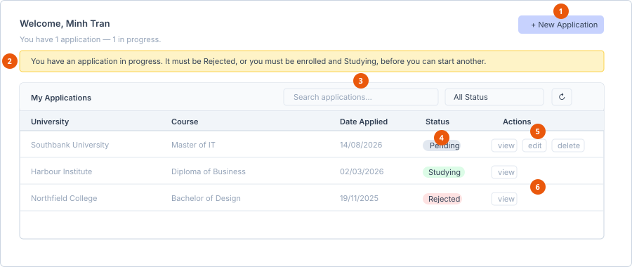

# Track application status

**Who can do this:** Student
**Where:** Student Portal → **Application**
**Before you start:** You need at least one application.

## The list screen

The header greets you by name and, once you have applications, summarises them:
*You have 2 applications — 1 in progress, 1 completed.*

1. **New Application** — greyed out while you have one in progress.
2. **In-progress warning** — explains why you cannot start another.
3. **Search and status filter** — narrow the list instantly.
4. **Status badge** — Pending, Approved, Rejected or Studying.
5. **Row buttons on a Pending application** — View, Edit and Delete.
6. **Row buttons once locked** — View only.

### Table columns

| Column | Shows |
|---|---|
| University | The education partner you applied to. |
| Course | The course or program. |
| Date Applied | Formatted `dd/MM/yyyy`. |
| Status | Pending, Approved, Rejected or Studying. |
| Actions | The buttons described below. |

### Finding an application

| Control | What it does |
|---|---|
| Search box | Filters the list as you type. |
| Status dropdown | *All Status*, *Pending*, *Approved*, *Rejected*, *Studying*. |
| Refresh icon | Reloads the list from the server. |

Search and filter run on the applications already loaded, so they are instant.

### Row buttons

| Button | When it appears |
|---|---|
| **View** | Always. |
| **Edit** | Only while the status is **Pending**. Hidden once the application is Approved, Rejected or Studying. |
| **Delete** | Same rule as Edit. |

If you have no applications at all, the table is replaced with *You haven't
applied to anything yet.*

## What the statuses mean

| Status | Meaning | Can you start another application? |
|---|---|---|
| **Pending** | Submitted, waiting on the admissions team. | No |
| **Approved** | Accepted, being progressed to enrolment. | No |
| **Rejected** | Not successful. | Yes |
| **Studying** | Staff have enrolled you and you are studying. | Yes |

While you hold a Pending or Approved application, the list shows a warning:
*You have an application in progress. It must be Rejected, or you must be
enrolled and Studying, before you can start another.*

## The detail screen

Select **View** to open an application. Approved, Rejected and Studying
applications open read-only, with a banner saying so. The status appears as a
coloured badge next to the university name.

The left column carries up to three panels.

**Applicant Details** — your name, email and application date, from your
account.

**Enrolment progress** — appears once staff create an enrolment for you. It is
a vertical stepper marking the stage you have reached. If the enrolment is
cancelled or unsuccessful, the stepper is replaced by: *This enrolment was
cancelled / not successful. Contact your counsellor for next steps.* When staff
are pursuing several course options for you, a line underneath says how many,
and names the one that has been finalised.

**Requested Forms** — appears when staff have sent you a form. Each row shows
the form name, its status badge, and a button reading **Fill** if it is still
open or **View** if you have already submitted it. See
[Submit a form request](../forms/submit-a-form-request.md).

The right column shows the application itself — Program Selection, Address &
Emergency Contact, and Required Documents — with every field disabled once the
application is locked.

## Staying informed

The bell in the portal header shows notifications as staff progress your
application, while you are signed in.

## See also

- [Create an application](create-an-application.md)
- [Statuses](../../reference/statuses.md)
