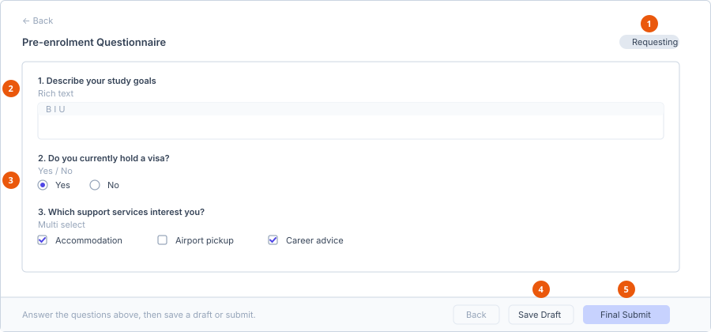

# Submit a form request

**Who can do this:** Student
**Where:** Student Portal → **Application** → open the application →
**Requested Forms**
**Before you start:** Staff must have sent you a form. Until they do, the
**Requested Forms** panel does not appear.

## Open the form

1. In the sidebar, select **Application**.
2. Select **View** on the application the form belongs to.
3. In the **Requested Forms** panel on the left, find the form.
4. Select **Fill**.

If the button reads **View** instead of **Fill**, you have already submitted
that form — see [Viewing a submitted form](#viewing-a-submitted-form).

## Answer the questions

1. **Form status** — Requesting until you save or submit.
2. **Rich text question** — a formatted text box.
3. **Yes / No and select questions** — radio buttons or tick boxes.
4. **Save Draft** — keeps the form editable.
5. **Final Submit** — asks you to confirm, then locks the form.

Your provider builds each form from a template, so the questions differ. Four
question types are used:

| Type | How you answer |
|---|---|
| Rich text | A formatted text box. |
| Yes / No | Pick one of two options. |
| Single select | Pick exactly one option from a list. |
| Multi select | Tick as many options as apply. |

## Save or submit

The bar at the bottom of the screen reads *Answer the questions above, then save
a draft or submit.*

| Button | What it does |
|---|---|
| **Back** | Returns to the application without saving. |
| **Save Draft** | Saves your answers and keeps the form editable. The status becomes **Draft**. |
| **Final Submit** | Opens a confirmation, then locks the form. |

Selecting **Final Submit** opens a dialog titled *Submit and lock this form?*:

> Once submitted, you won't be able to edit your answers. If you need to make
> changes afterward, you'll have to contact your enrolment staff to unlock it
> back to Draft. You can still view your submitted answers at any time.

Choose **Go back** to keep editing, or **I agree, submit** to send it.

**Result:** The status becomes **Responded**, the form is locked, and staff can
see your answers.

## Form statuses

| Status | Meaning |
|---|---|
| **Requesting** | Staff sent it. You have not saved anything yet. |
| **Draft** | You have saved answers but not submitted. Still editable. |
| **Responded** | Submitted and locked. |
| **Withdrawn** | Staff recalled the form before you completed it. |
| **Archived** | Kept for the record, no longer active. |

## Viewing a submitted form

Opening a locked form shows a banner — *This form has been submitted and can't
be edited. Contact your enrolment staff if you need changes.* — followed by a
print-friendly view of your answers with the submission date. The only button
is **Back to Application**.

To change a submitted answer, ask staff to unlock the form back to **Draft**.

## If something goes wrong

| Symptom | Cause | What to do |
|---|---|---|
| No **Requested Forms** panel | Staff have not sent you a form on this application. | Contact your provider. |
| The button says **View**, not **Fill** | The form is already submitted. | Ask staff to unlock it. |
| Your answers are missing when you return | You left without selecting **Save Draft**. | Re-enter them and save a draft as you go. |

## See also

- [Track application status](../applications/track-application-status.md)
