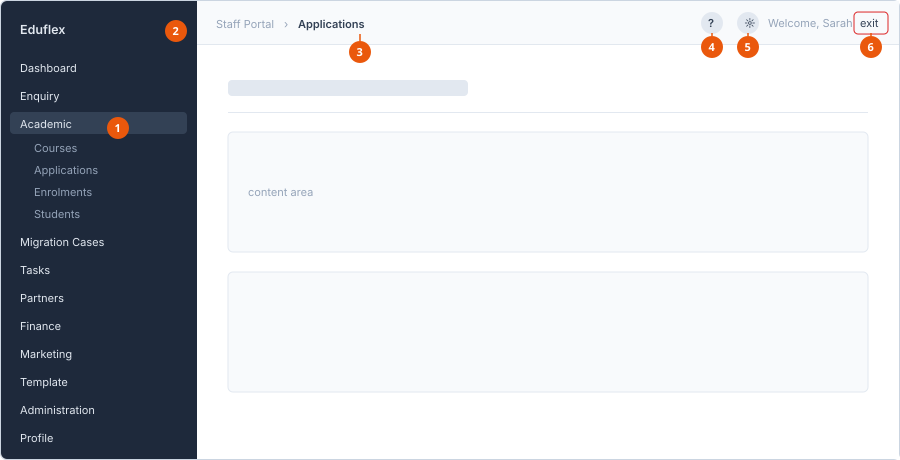

# Portal tour

The portal has three fixed areas: the sidebar on the left, the header across
the top, and the content area.

1. **Sidebar menu** — your available modules. Groups expand to show their pages.
2. **Collapse control** — shrinks the sidebar to icons only.
3. **Breadcrumb** — where you are. The first part links back to the portal home.
4. **Help** — opens the help topic for the screen you are on.
5. **Notifications** — new activity while you are signed in.
6. **Logout** — signs you out, after a confirmation.

## Sidebar

These are your menu items.

| Menu item | What it is for |
|---|---|
| Dashboard | Summary of your applications and anything waiting on you. |
| Application | Your course applications and their forms. |
| My Courses | Courses you are enrolled in. |
| Profile | Your personal and contact details. |

Select the collapse control at the top of the sidebar to shrink it to icons.

## Header

| Control | What it does |
|---|---|
| Breadcrumb | Shows where you are, and links back to the portal home. |
| **?** | Opens the help topic for the screen you are on. |
| Bell | Shows notifications as they arrive. |
| **Logout** | Signs you out. You are asked to confirm. |

## See also

- [Key concepts](key-concepts.md)
