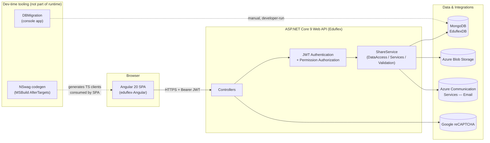
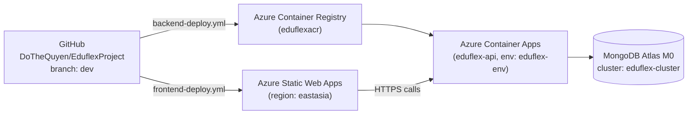
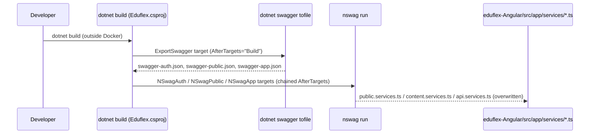

# Eduflex — System Architecture

> Scope: this document describes the system as it actually exists in the repository at
> `D:\Self training\EduflexProject`, not an aspirational target. Where the real implementation
> diverges from good practice, that is called out inline as **⚠ Known issue**, with the full
> remediation backlog collected in [05-findings-and-recommendations.md](05-findings-and-recommendations.md).
>
> Companion documents: [02-database-design.md](02-database-design.md) ·
> [03-backend-design.md](03-backend-design.md) · [04-frontend-design.md](04-frontend-design.md) ·
> [06-configuration-and-endpoints-guide.md](06-configuration-and-endpoints-guide.md) ·
> [07-frontend-onboarding-walkthrough.md](07-frontend-onboarding-walkthrough.md)

## 1. What Eduflex is

Eduflex is a student-application / course-management portal: a public marketing site (home,
about, course promotions, enquiries, feedback) sitting in front of an authenticated staff/student
portal (applications, profile, role & user management, feedback & course-promotion management).

## 2. High-level architecture



**Runtime components** are only two: the Angular SPA and the ASP.NET Core API. `DBMigration`
is a standalone console tool a developer runs by hand against Mongo — it is never invoked by the
API at startup or at any other time (see [02-database-design.md](02-database-design.md) §3).
NSwag code generation runs at **build time** on the developer's machine, not at runtime — it
regenerates the three Angular API-client files whenever the backend is rebuilt outside Docker.

## 3. Repository / solution layout

```
EduflexProject/                         <- git root
├── Eduflex/Eduflex/                     <- .NET solution root (Eduflex.sln)
│   ├── Eduflex/                         <- ASP.NET Core 9 Web API (the host)
│   │   ├── Controllers/                 <- 9 controllers, one per feature
│   │   ├── DTOs/                        <- one folder per feature, one class per DTO
│   │   ├── Mapping/                     <- hand-written ToDto()/ToModel() extension methods
│   │   ├── Authorization/               <- custom IAuthorizationHandler/Requirement/Attribute
│   │   ├── appsettings.json / appsettings.Development.json
│   │   ├── Properties/launchSettings.json
│   │   ├── Dockerfile
│   │   ├── Eduflex.csproj               <- MSBuild targets that drive Swagger export + NSwag
│   │   ├── nswag.json / nswag.app.json / nswag.auth.json / nswag.public.json
│   │   └── Program.cs                   <- composition root
│   ├── ShareService/                    <- shared class library (net8.0)
│   │   ├── DataAccess/                  <- one hand-written Mongo repository per aggregate
│   │   ├── Services/                    <- business logic, one service per feature
│   │   ├── Validations/                 <- FluentValidation validators
│   │   ├── Models/                      <- BSON-mapped POCOs, feature-organized
│   │   ├── Inject/Init.cs               <- single DI composition extension (AddSharedServices)
│   │   └── Template/                    <- email HTML templates
│   ├── ShareService.Tests/              <- NUnit + Moq + FluentAssertions (thin coverage: 3 classes)
│   ├── DBMigration/                     <- standalone console app (net8.0, OutputType=Exe)
│   │   ├── Migrations/                  <- 13 numbered migration classes
│   │   ├── Services/                    <- MigrationRegistrationService, MigrationService, ModelGenerator...
│   │   └── Models/                      <- MigrationRecord, MongoDBSettings, legacy mirror models
│   └── docker-compose.yml               <- eduflex-api + eduflex-angular + mongo
├── eduflex-Angular/                     <- Angular 20.3 SPA (standalone components, SSR-capable)
│   ├── src/app/
│   │   ├── app.config.ts                <- providers: router, HttpClient+interceptor, API base URL tokens
│   │   ├── app.routes.ts                <- single flat routes array (public + 2 portals)
│   │   ├── environments/                <- environment.ts / environment.prod.ts
│   │   ├── services/                    <- 3 NSwag-generated clients + hand-written services
│   │   ├── guards/                      <- AuthGuard, RoleGuard, auth.interceptor.ts
│   │   ├── components/                  <- public site + portal feature components
│   │   └── models/                      <- a few hand-written interfaces (mostly superseded by NSwag DTOs)
│   ├── src/generic-components/          <- app-data-table, app-modal, app-notification, file-uploader, datetime-picker
│   ├── angular.json / .postcssrc.json
│   └── .github/workflows/               <- CI/CD (see §6)
└── docs/                                <- this document set
```

**Convention used everywhere in the backend**: every layer (`Models`, `DataAccess`,
`Services`, `Validations`, `DTOs`, `Mapping`) is subdivided into the **same set of
feature folders** (`Auth`, `Application`, `Role`, `Permission`, `Enquiry`, `Feedback`,
`CoursePromotion`, `Student`, `Education`, `Address`, `Institution`). When adding a new
feature, create the matching subfolder in each of these six places rather than inventing a
new organizing scheme.

## 4. Deployment topology (Azure)

The AWS reference architecture (ECR → ECS Fargate + ALB → S3, see `Eduflex/Eduflex/build aws.txt`
and `taskdef.json`) was mirrored onto Azure as a learning exercise. Current live topology:



| Concern | AWS (reference) | Azure (current) |
|---|---|---|
| Image registry | ECR | Azure Container Registry (`eduflexacr`) |
| Container hosting | ECS Fargate + ALB | Azure Container Apps (built-in ingress/load-balancing) |
| Static frontend hosting | S3 | Azure Static Web Apps |
| Database | self-hosted / Cosmos DB (Mongo API, tried and rejected) | **MongoDB Atlas M0** (real MongoDB, not a wire-protocol-compatibility layer) |
| Resource grouping | — | Resource group `rg-eduflex`, region `australiaeast` (Static Web Apps forced to `eastasia` — not available in `australiaeast`) |

Cosmos DB's Mongo API was evaluated and deliberately abandoned in favor of real MongoDB Atlas
because Cosmos's Mongo compatibility layer is RU-throttled, capped at roughly wire-protocol 4.2,
and restricts transactions — see [02-database-design.md](02-database-design.md) §1 for why this
matters given how the app uses Mongo.

## 5. Configuration files — purpose and key settings

### Backend

| File | Purpose | Key settings |
|---|---|---|
| `Eduflex/appsettings.json` | Primary runtime config, bound into 7 strongly-typed `IOptions<T>` classes in `Program.cs` | `ConnectionStrings:MongoDBConnection`, `MongoDBSettings:DatabaseName` (`EduflexDB`), `JWT:{Secret,Salt}`, `Cors:AllowedOrigins`, `WebURLSettings:FrontendBaseUrl`, `AzureBlobStorage:{ConnectionString,ContainerName}`, `AzureEmailSettings:{ConnectionString,SenderAddress}`, `Recaptcha:{VerifyUrl,SecretKey}`, `FeedbackSettings`/`CoursePromotionSettings:DefaultLatestCount` |
| `Eduflex/appsettings.Development.json` | Dev-only overrides | Only `Logging` levels — no secrets duplicated here |
| `Eduflex/Properties/launchSettings.json` | Local debug launch profiles | `http` (`:5246`), `https` (`:5083`/`:5084`), `IIS Express`, `Container (Dockerfile)` (`ASPNETCORE_HTTPS_PORTS=8081`, `HTTP_PORTS=8080`); all set `ASPNETCORE_ENVIRONMENT=Development`, `launchUrl: swagger` |
| `Eduflex/Eduflex.csproj` | Project file **and** build-time NSwag pipeline driver | See §6 below — the `ExportSwagger`/`NSwagAuth`/`NSwagPublic`/`NSwagApp` MSBuild targets |
| `Eduflex/Dockerfile` | Two-stage build (`sdk:9.0` → `aspnet:9.0`), sets `ASPNETCORE_URLS=http://+:80`, entrypoint `dotnet Eduflex.dll` | Passes `-p:BuildingInsideDocker=true` on `dotnet publish`, which is exactly the flag the NSwag MSBuild targets check to skip themselves inside Docker |
| `Eduflex/Eduflex/docker-compose.yml` | Local 3-service compose: `eduflex-api`, `eduflex-angular`, `mongo:7` | ⚠ see finding in [05](05-findings-and-recommendations.md) — its Mongo connection-string env override doesn't match the key the app actually reads |
| `DBMigration/appsettings.json` + gitignored `appsettings.local.json` | Per-environment Mongo connection strings for the migration console tool | `MongoDBEnvironments:{Dev,Test,Pro}:{ConnectionString,DatabaseName}` |

### NSwag (backend → frontend codegen bridge)

Four config files live in `Eduflex/`, each paired with an MSBuild target. Full mechanics —
including the live `content.services.ts` base-URL bug — are in
[04-frontend-design.md](04-frontend-design.md) §2.

| Config | OpenAPI source | Output (Angular) | Base-URL token |
|---|---|---|---|
| `nswag.json` | Live reflection (`aspNetCoreToOpenApi`) | `services/test.services.ts` | `API_BASE_URL` | 
| `nswag.auth.json` | Static `swagger-auth.json` | `services/public.services.ts` | `AUTH_API_BASE_URL` |
| `nswag.app.json` | Static `swagger-app.json` | `services/api.services.ts` | `APPLICATION_API_BASE_URL` |
| `nswag.public.json` | Static `swagger-public.json` | `services/content.services.ts` | `APPLICATION_API_BASE_URL` (name collides with `nswag.app.json`'s — separate token object though) |

`nswag.json` is **dead config** — its output file (`test.services.ts`) doesn't exist in the
Angular repo and no MSBuild target invokes it. The three live configs consume static Swagger
JSON snapshots (`swagger-{auth,app,public}.json`) rather than a live URL, because those snapshots
are produced from the just-built DLL one step earlier in the same MSBuild target chain.

### Frontend

| File | Purpose | Key settings |
|---|---|---|
| `eduflex-Angular/angular.json` | Angular CLI project config (esbuild-based `@angular/build:application`) | `outputMode: "static"`, global `styles` array (Bootstrap CSS loads **before** `styles.css`/`theme.css`), `configurations.production` sets bundle budgets + `outputHashing: all` + the `fileReplacements` swap of `environment.ts`→`environment.prod.ts`; `serve` target defaults to `development`, `build` target defaults to `production` — asymmetric defaults, easy to trip over |
| `src/app/environments/environment.ts` / `environment.prod.ts` | API origin + reCAPTCHA site key per build config | `production`, `apiClientUrl`, `publicApiUrl`, `recaptchaSiteKey` — only swapped in by the `fileReplacements` block above, nothing else |
| `src/app/app.config.ts` | Root DI provider set for the standalone app | `provideRouter(routes)`, `provideHttpClient(withInterceptors([authInterceptor]), withFetch())`, `provideAnimationsAsync()`, and the two `APPLICATION_API_BASE_URL`/`AUTH_API_BASE_URL` token bindings — see ⚠ the `content.services.ts` token gap in [04](04-frontend-design.md) |
| `.postcssrc.json` | Enables Tailwind v4's PostCSS plugin | `{ "plugins": { "@tailwindcss/postcss": {} } }` — no extra plugins; Tailwind v4 handles autoprefixing internally |
| `src/styles.css` | Tailwind wiring, deliberately skipping Preflight so Bootstrap's reset survives; defines the navy/brass `@theme` token palette | See [04-frontend-design.md](04-frontend-design.md) §7 |

### CI/CD

| File | Trigger | What it does |
|---|---|---|
| `.github/workflows/backend-deploy.yml` | Push to `dev` touching `Eduflex/**` | Build Docker image → push to ACR (`eduflexacr`) → `az containerapp update` on `eduflex-api`. Auth via GitHub secret `AZURE_CREDENTIALS` (service principal scoped to `rg-eduflex` only). |
| `.github/workflows/frontend-deploy.yml` | Push to `dev` touching `eduflex-Angular/**` | `npm ci --legacy-peer-deps` → Angular prod build → `Azure/static-web-apps-deploy@v1` using secret `AZURE_STATIC_WEB_APPS_API_TOKEN`. |

Local `npm install`s on this repo should use `npm install --force` (not `--legacy-peer-deps`) —
the dependency tree has known peer-conflicts (`angular-datatables@19` doesn't declare an Angular
20 peer; `@angular/platform-browser-dynamic` has drifted from the rest of `@angular/*` before).

## 6. Build-time code generation pipeline (the full local `dotnet build` chain)

This is the mechanism that keeps the Angular API clients in sync with the backend without a
developer ever hand-running `nswag`:



All four targets are gated by `Condition="'$(BuildingInsideDocker)' != 'true'"`, and the
`Dockerfile` passes `-p:BuildingInsideDocker=true` on `dotnet publish` specifically to skip this
chain in CI/container builds (which don't have Node/the `nswag` CLI available and don't need to
regenerate a client that ships separately via the frontend pipeline). **Practical implication for
developers**: after changing a controller's route, DTO shape, or adding an endpoint, a plain local
`dotnet build` of the `Eduflex` project is enough to regenerate the correct Angular client —
no manual `nswag run` needed. Full codegen settings and consumption pattern are detailed in
[04-frontend-design.md](04-frontend-design.md) §2.

## 7. Cross-cutting notes

- **Mixed target frameworks**: `Eduflex` = net9.0, `ShareService`/`DBMigration` = net8.0,
  `ShareService.Tests` = net9.0. Multi-targeting a shared library one major version behind the
  host works fine on .NET, but should be a deliberate choice, not drift — confirm before adding
  net9-only APIs to `ShareService`.
- **No secrets management** — JWT secret/salt, Azure Blob/Email keys, and the reCAPTCHA secret
  all live in plaintext in the committed `appsettings.json`. See
  [05-findings-and-recommendations.md](05-findings-and-recommendations.md) for the remediation
  priority (rotate + move to Container Apps secrets / Key Vault / user-secrets).
- **Swagger UI is reachable in every environment**, not just Development — `Program.cs` calls
  `app.UseSwagger()`/`UseSwaggerUI()` unconditionally before the `IsDevelopment()` check (which
  only wraps a redundant second call). If this API is ever treated as more than a learning
  project, gate Swagger behind the Development check.
