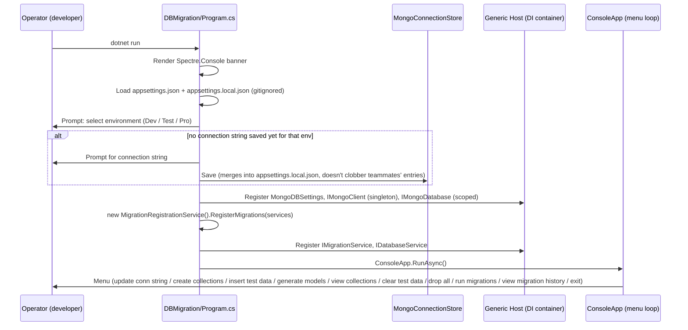

# Eduflex — Database Design

> Companion documents: [01-system-architecture.md](01-system-architecture.md) ·
> [03-backend-design.md](03-backend-design.md) · [04-frontend-design.md](04-frontend-design.md)

## 1. Why MongoDB, and what that means for this schema

Eduflex uses **MongoDB Atlas** (real MongoDB, not Cosmos DB's Mongo-wire-protocol compatibility
layer — that was tried and deliberately rejected, see
[01-system-architecture.md](01-system-architecture.md) §4). The core principles that should
govern every schema decision in this codebase:

1. **Schema-on-read, not schema-on-write.** MongoDB does not enforce a collection schema at the
   database level — every document in a collection *can* have different fields. Eduflex's
   approach to this is C#-side discipline: each collection has exactly one POCO model
   (`ShareService/Models/**/*.cs`) that the application code always reads/writes through, so the
   schema is enforced by convention in the driver layer, not by the database. This is fine as
   long as every write path goes through the typed `IMongoCollection<TModel>` — a raw
   `BsonDocument` write (which the DBMigration project does deliberately, see §3) bypasses that
   discipline and can silently drift the shape of documents in a collection.
2. **Model the document around how it's read, not how it's normalized.** Relational instinct
   says "put `Role` in its own table and foreign-key to it" — Mongo's instinct is "embed what you
   always read together, reference what you query/update independently." Eduflex actually does
   both, deliberately: `Roles` and `Permissions` are separate collections (referenced by
   `roleId`/`permissionIds` string arrays from `Users`/`Roles`) because permissions are managed
   and queried independently of any one user, but a `UserModel` embeds its own profile fields
   directly rather than splitting into a separate `Profiles` collection, because a user's profile
   is always read together with the user.
3. **No cross-collection transactions/joins in the driver layer.** Every `DataAccess` class talks
   to exactly one collection (see §2). Any "join" the app needs (e.g. resolving a user's role
   *name* from their `roleId`) is done in application code with a second query
   (`AuthController.Login` calls `_roleService.GetByIdAsync(user.RoleId)` after loading the user)
   — there is no `$lookup` aggregation pipeline in use anywhere in the codebase today. This is a
   deliberate simplicity trade-off: fine at current data volumes, but the first place to look if
   N+1-style query patterns ever become a performance problem.
4. **Indexes are the only enforcement mechanism for uniqueness/query performance**, since there
   are no foreign keys or check constraints. Every index in this system is created idempotently
   by a migration (see §3.4) — there is no "the DBA added an index by hand" path.
5. **`ObjectId` as the primary key, represented as a `string` in C#.** Every model uses:
   ```csharp
   [BsonId]
   [BsonRepresentation(BsonType.ObjectId)]
   public string Id { get; set; }
   ```
   so C# code always deals with `Id` as a plain `string` (convenient for DTOs/JSON/JWT claims),
   while Mongo stores it as a native `ObjectId` (compact, index-friendly, roughly time-sortable).

## 2. Collection catalog and model mapping

| Collection | Model | Key fields | Notes |
|---|---|---|---|
| `Users` | `UserModel` | `Email` (`[BsonRequired]`), `PasswordHash` (`[BsonRequired]`), `RoleId`, `MustChangePassword`, `LastLogin`, `CreatedAt` | No `UpdatedAt`. Partition/shard key when this briefly lived in Cosmos DB was `email` (no leading slash — Cosmos's Mongo API differs from Core API shard-key syntax here; irrelevant now that the DB is Atlas). |
| `Applications` | `ApplicationModel` | student/date/status fields | Has both `CreatedAt` and `UpdatedAt`. 3 named indexes: `idx_student_date`, `idx_status`, `idx_status_date` (added by migration `001`, see §3.4). |
| `Roles` | (raw `BsonDocument`, seeded by migration `010`) | `Name`, `permissionIds: string[]` | Not currently modeled as a typed `RoleModel` class in every code path — the migration that created this collection writes raw BSON; `RoleService`/`RolesController` read it via `ShareService.Models.Role.RoleModel` afterward. |
| `Permissions` | seeded by migration `011` (raw `BsonDocument`) | permission key strings, e.g. `applications.view`, `users.delete`, `finance.*`, `coursepromotions.*` | The catalog `PermissionKeys.cs` in `ShareService/Common/` centralizes these strings for C#-side reference; the Mongo documents are the source of truth for what's *actually* granted to a role. |
| `Modules` | seeded by migration `011` | e.g. `"Applications"` module | Groups permissions for the admin UI (Role Management screen renders permissions grouped by module). |
| `Enquiries`, `Feedbacks`, `CoursePromotions` | `EnquiryModel`, `FeedbackModel`, `CoursePromotionModel` | feature-specific | Same per-feature-folder convention as everything else in `ShareService/Models`. |
| `_migrations` | `MigrationRecord` (`DBMigration/Models/MigrationRecord.cs`) | `migrationId` (unique index), `name`, `description`, `appliedAt`, `executionTimeMs`, `success`, `errorMessage` | The migration-history ledger — see §3.3. |

**No shared base entity.** There is no `BaseModel`/`IEntity` interface anywhere in
`ShareService/Models` — every model independently re-declares its own `Id`, and audit fields
(`CreatedAt`/`UpdatedAt`) are present or absent per model with no consistent convention
(`UserModel` has `CreatedAt` only, `ApplicationModel` has both, `RoleModel` has neither). See
[05-findings-and-recommendations.md](05-findings-and-recommendations.md) for the recommendation
to introduce a common base.

**No collection-name constants class.** Collection names are repeated string literals —
`database.GetCollection<UserModel>("Users")` appears independently in
`ShareService/DataAccess/Service/UserDB.cs`, `Authentication.cs`, and again in
`DBMigration/Services/Services/DatabaseService.cs` and the migration files themselves. Contrast
this with `PermissionKeys.cs`, which *does* centralize permission strings — collection names
deserve the same treatment.

## 3. How the program works: DBMigration end-to-end

`DBMigration` is a **standalone console executable** (`DBMigration.csproj`,
`OutputType=Exe`, net8.0) — it shares nothing at runtime with the `Eduflex` Web API beyond the
`ShareService` library and, by convention, pointing at the same MongoDB database. **The API never
runs migrations itself** — there is no hosted service or startup check in `Eduflex/Program.cs`
that touches `_migrations`. A human runs `dotnet run` inside `DBMigration/` and drives an
interactive menu.

### 3.1 Startup and environment selection



Destructive actions against the `Pro` environment require the operator to type the environment
name back as an explicit confirmation (`ConfirmProAction`) before they execute.

### 3.2 Migration discovery — `MigrationRegistrationService`

This is the piece the task specifically asked about. Its job is purely **reflection-based
discovery and DI registration** — it does not execute anything itself.

```csharp
public class MigrationRegistrationService : IMigrationRegistrationService
{
    public void RegisterMigrations(IServiceCollection services)
    {
        var migrationTypes = GetMigrationTypes();
        foreach (var type in migrationTypes)
        {
            services.AddTransient(type);
            Console.WriteLine($"✅ Auto-registered migration: {type.Name}");
        }
    }

    public List<Type> GetMigrationTypes()
    {
        var migrationTypes = new List<Type>();
        foreach (var assembly in AppDomain.CurrentDomain.GetAssemblies())
        {
            try
            {
                var types = assembly.GetTypes()
                    .Where(t => typeof(IMigration).IsAssignableFrom(t)
                             && !t.IsInterface && !t.IsAbstract
                             && t.Name.StartsWith("_"))
                    .OrderBy(t => t.Name);
                migrationTypes.AddRange(types);
            }
            catch (Exception ex) { Console.WriteLine($"⚠️ Could not scan assembly {assembly.FullName}: {ex.Message}"); }
        }
        return migrationTypes.OrderBy(t => t.Name).ToList();
    }
}
```

**How it "reads" migration scripts, precisely**: it does not read files at all — it reflects over
every assembly already loaded into the current `AppDomain`, looking for concrete classes that (a)
implement `IMigration`, and (b) have a C# **class name** starting with `_` (underscore). There is
no attribute, no naming registry, no directory scan — a class becomes a discovered migration
purely by matching that reflection predicate. This is why every migration class is named like
`_010_AddRolesAndUserRoleId_200726` rather than `AddRolesAndUserRoleId` — the leading underscore
is not decoration, it is the entire discovery mechanism.

Ordering is `OrderBy(t => t.Name)` — a **lexicographic string sort**. This only produces correct
numeric order because every migration author has zero-padded the numeric prefix (`001`...`013`).
⚠ This is a latent bug: it would silently misorder migrations past `_999_...`, or if anyone ever
adds `_2_Foo` next to `_10_Bar` without padding — nothing enforces the padding convention besides
author discipline. See [05-findings-and-recommendations.md](05-findings-and-recommendations.md).

Each discovered type is registered `AddTransient` — a fresh instance per resolution, appropriate
since migrations are stateless besides the `IMongoDatabase` they operate on.

### 3.3 Execution — `MigrationService.RunMigrationsAsync`

```csharp
public async Task<bool> RunMigrationsAsync()
{
    await EnsureMigrationsCollectionAsync();          // creates "_migrations" + unique index on migrationId
    var appliedMigrations = await GetAppliedMigrationIdsAsync();
    var allMigrations = DiscoverMigrations();          // resolves every IMigration instance via DI
    var pendingMigrations = allMigrations
        .Where(m => !appliedMigrations.Contains(m.MigrationId))
        .OrderBy(m => m.MigrationId)
        .ToList();

    if (!pendingMigrations.Any()) { _logger.LogInformation("✅ No pending migrations found."); return true; }

    foreach (var migration in pendingMigrations)
    {
        var success = await ExecuteMigrationAsync(migration);
        if (!success)
        {
            _logger.LogError($"❌ Migration {migration.MigrationId} failed. Stopping migration process.");
            return false;   // stop-on-first-failure — no partial-batch continue
        }
    }
    return true;
}
```

`ExecuteMigrationAsync` wraps `migration.Up(_database)` in a stopwatch + try/catch, and **always**
writes a `MigrationRecord` into `_migrations` — on success with `Success = true` and the elapsed
milliseconds, on failure with `Success = false` and `ErrorMessage`. The unique index on
`migrationId` means a **failed** migration's record occupies that `migrationId` permanently; if
the migration is fixed and re-run, the insert of a second record with the same `migrationId` will
throw a duplicate-key error rather than being treated as "still pending" — see
[05-findings-and-recommendations.md](05-findings-and-recommendations.md) for the workaround
(delete the failed record manually before retrying) and the proper fix.

**Rollback** (`RollbackMigrationAsync(migrationId)`) resolves the matching `IMigration`, calls
`Down(_database)`, then deletes its `_migrations` record. It rolls back exactly one migration at a
time — there is no cascading/dependency-aware multi-step rollback.

### 3.4 The `IMigration` contract and idempotency via `SafeMigrationBase`

```csharp
public interface IMigration
{
    string MigrationId { get; }
    string Name { get; }
    string Description { get; }
    Task Up(IMongoDatabase database);
    Task Down(IMongoDatabase database);
}
```

Every concrete migration inherits `SafeMigrationBase`, which supplies check-then-act helpers so
`Up`/`Down` can be safely re-run without the history-collection check being the *only* thing
preventing double-application:

- `CollectionExistsAsync` / `FieldExistsAsync`
- `IndexExistsAsync` / `GetExistingIndexNamesAsync`
- `CreateIndexSafeAsync` (no-op if the named index already exists) / `DropIndexSafeAsync`
- `ParseObjectId`

**Versioning scheme**: `{3-digit zero-padded sequence}_{PascalCase description}_{ddMMyy}`, baked
into both the file name (`013_AddRolesAndUsersManagementPermissions_200726.cs`) and the class name
(`_013_AddRolesAndUsersManagementPermissions_200726`). The trailing date is for human traceability
only — it plays no role in ordering (see §3.2).

**Concrete examples on disk** (`DBMigration/Migrations/`):

| # | Class | What it does |
|---|---|---|
| `001` | `_001_AddApplications_290925` | Pure index migration: ensures `Applications` exists, creates `idx_student_date`/`idx_status`/`idx_status_date`. `Down` drops them. No data mutation — a good template for index-only migrations. |
| `010` | `_010_AddRolesAndUserRoleId_200726` | Real data migration: seeds `Admin`/`Student` into a new `Roles` collection (raw `BsonDocument`), then walks every `Users` document mapping its old free-text `role` string to the new role's `ObjectId` as `roleId`, unsetting `role`. `Down` reverses the mapping and drops `Roles`. This is the migration that introduced roleId-based RBAC. |
| `011` | `_011_AddModulesAndPermissionsCatalog_200726` | Seeds `Modules` + `Permissions` catalogs, then rewires `Admin`/`Student` role documents from a free-text `permissions: string[]` to `permissionIds: string[]` referencing the new catalog. Depends on `010` having already created `Roles`. |
| `012`, `013` | Finance/CoursePromotions permissions, Roles/Users management permissions | Same seed-more-permissions-into-the-catalog pattern as `011`. |

### 3.5 Writing a new migration — developer workflow

1. Add a new file `DBMigration/Migrations/{next-number}_{Description}_{ddMMyy}.cs`, zero-padding
   the number to 3 digits and continuing the existing sequence.
2. Class name must match the file name exactly, **including the leading underscore** — this is
   what makes discovery find it (§3.2). Inherit `SafeMigrationBase`, implement `Up`/`Down`.
3. Prefer the `SafeMigrationBase` helpers (`CreateIndexSafeAsync`, `FieldExistsAsync`, etc.) over
   raw driver calls so the migration is safe to re-run manually if needed.
4. Run the `DBMigration` console app, select the target environment, choose "Run Database
   Migrations." The new migration will be auto-discovered and picked up because it's now loaded
   in the assembly — no registration step to remember.
5. Verify via "View Migration History" in the same menu, which reads `_migrations` directly.

## 4. Connection & database resolution

- Eduflex API: `Program.cs` reads `ConnectionStrings:MongoDBConnection` from `appsettings.json`
  (`builder.Configuration.GetConnectionString(...)`), registers `IMongoClient` as a **singleton**
  (correct per MongoDB driver guidance — the client owns the connection pool) and `IMongoDatabase`
  as **scoped** (unnecessary since `GetDatabase` is cheap and stateless, but harmless).
- DBMigration console: per-environment connection strings under `MongoDBEnvironments:{Dev,Test,Pro}`
  in `appsettings.json`, with the actual string typically supplied interactively at first run and
  persisted to the gitignored `appsettings.local.json` via `MongoConnectionStore`.
- There is **no active unifying `DbContext`-style class**. `ShareService/DataAccess/Service/MongoDbContext.cs`
  and its interface exist but are fully commented out, with a comment noting they're a parked
  EF-Core-based experiment ("Keep this for future practice"). The live abstraction is simply the
  injected `IMongoDatabase`, obtained directly by each `DataAccess` class's constructor.
