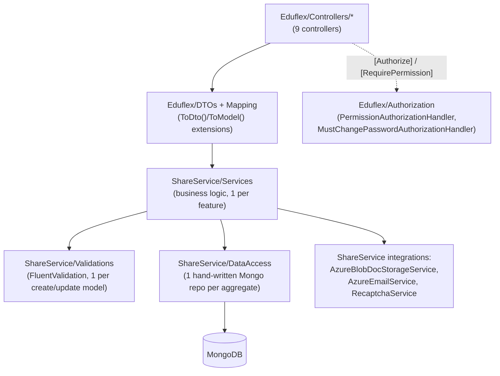

# Eduflex — Backend Design

> Companion documents: [01-system-architecture.md](01-system-architecture.md) ·
> [02-database-design.md](02-database-design.md) · [04-frontend-design.md](04-frontend-design.md)

## 1. Layered architecture



There is no generic repository interface and no AutoMapper — both are deliberate simplicity
choices in this codebase (confirmed absent from every `.csproj`), documented in detail below so a
new contributor isn't left guessing whether they're missing a file.

## 2. Composition root — `Eduflex/Program.cs`

Minimal-hosting-model, top-level statements. Pipeline, in registration order:

```csharp
var builder = WebApplication.CreateBuilder(args);
builder.Services.AddControllers();
builder.Services.AddEndpointsApiExplorer();
builder.Services.AddMemoryCache();
builder.Services.AddHealthChecks();

// Serilog: file sink (logs/log.txt, monthly rolling) + whatever appsettings.json configures
Log.Logger = new LoggerConfiguration()
    .ReadFrom.Configuration(builder.Configuration)
    .WriteTo.File("logs/log.txt", rollingInterval: RollingInterval.Month)
    .MinimumLevel.Information()
    .CreateLogger();
builder.Host.UseSerilog();

// 3 separate Swagger documents, one per NSwag-consumed "API surface"
builder.Services.AddSwaggerGen(c =>
{
    c.SwaggerDoc("auth", new OpenApiInfo { Title = "Eduflex Auth API", Version = "v1" });
    c.SwaggerDoc("public", new OpenApiInfo { Title = "Eduflex Public API", Version = "v1" });
    c.SwaggerDoc("app", new OpenApiInfo { Title = "Eduflex App API", Version = "v1" });
    c.DocInclusionPredicate((docName, apiDesc) =>
        string.Equals(apiDesc.GroupName, docName, StringComparison.OrdinalIgnoreCase));
});
```

Each controller declares `[ApiExplorerSettings(GroupName = "auth"|"public"|"app")]` (or per-action
for controllers that mix groups, like `CoursePromotionsController` and `FeedbacksController`),
and `DocInclusionPredicate` routes each action into exactly the Swagger document matching its
group name. This 3-way split exists **specifically to produce 3 separate NSwag-generated Angular
clients** — see [04-frontend-design.md](04-frontend-design.md) §2 for the consuming side.

### Options binding (config → strongly-typed classes)

Seven `Configure<T>()` calls bind config sections to POCOs living in `ShareService/Models/Setting/`:

| Options class | Config section | Consumed by |
|---|---|---|
| `MongoDBSettings` | `MongoDBSettings` | Mongo client/database registration |
| `RecaptchaSettings` | `Recaptcha` | `RecaptchaService` |
| `FeedbackSettings` | `FeedbackSettings` | `FeedbackService` ("latest N" default) |
| `CoursePromotionSettings` | `CoursePromotionSettings` | `CoursePromotionService` |
| `AzureBlobSettings` | `AzureBlobStorage` | `AzureBlobDocStorageService` |
| `AzureEmailSettings` | `AzureEmailSettings` | `AzureEmailService` |
| `WebURLSettings` | `WebURLSettings` | link-building in emails (e.g. reset/welcome links back to the SPA) |

### MongoDB registration

```csharp
builder.Services.AddSingleton<IMongoClient>(sp =>
{
    var connectionString = builder.Configuration.GetConnectionString("MongoDBConnection");
    return new MongoClient(connectionString);
});
builder.Services.AddScoped<IMongoDatabase>(sp =>
{
    var settings = sp.GetRequiredService<IOptions<MongoDBSettings>>().Value;
    var client = sp.GetRequiredService<IMongoClient>();
    return client.GetDatabase(settings.DatabaseName);
});
```

`IMongoClient` singleton is correct (it owns the connection pool and is thread-safe by design).
`IMongoDatabase` scoped is unnecessary overhead (`GetDatabase` is a cheap, stateless handle) but
not harmful.

### CORS

Origins come from `Cors:AllowedOrigins` (array in config, e.g. `localhost:4200`/`:9000` in dev).
Policy `"AllowAngular"` = `AllowAnyHeader().AllowAnyMethod().AllowCredentials()` restricted to
those configured origins.

### Shared services registration

```csharp
builder.Services.AddSharedServices();   // ShareService.Inject extension — see §5
```

### Pipeline order (`app = builder.Build()` onward)

```csharp
app.UseSwagger();
app.UseSwaggerUI(c => { /* 3 SwaggerEndpoint entries, RoutePrefix "swagger" */ });

if (app.Environment.IsDevelopment())
{
    app.UseSwagger();       // redundant second call, only reached in Development
    app.UseSwaggerUI();
}

app.UseCors("AllowAngular");
app.UseAuthentication();
app.UseAuthorization();
app.MapControllers();

app.MapGet("/", () => "Eduflex API is running 🚀");
app.MapHealthChecks("/health");
app.Run();
```

Order (CORS → AuthN → AuthZ → MapControllers) is correct ASP.NET Core convention. Two gaps worth
knowing: there's no `UseHttpsRedirection()` and no exception-handling middleware
(`UseExceptionHandler`), so unhandled exceptions fall through to the default developer/production
error behavior rather than a controlled JSON error response. Also — because the first
`UseSwagger()/UseSwaggerUI()` call runs *before* the `IsDevelopment()` gate, **Swagger UI is
reachable at `/swagger` in every environment including Production**, not just Development.

## 3. Authentication

### Password hashing

Both the login-verification path (`AuthController`) and the create/change-password path
(`ShareService/Services/Service/UserService.cs`) use the **identical, duplicated** implementation:

```csharp
private string HashPassword(string password)
{
    using var sha256 = SHA256.Create();
    var bytes = Encoding.UTF8.GetBytes(password + _configuration["JWT:Salt"]);
    return Convert.ToBase64String(sha256.ComputeHash(bytes));
}
```

This is `SHA256(password + staticSalt)` → Base64, where the salt is a **single, application-wide,
static** value from config (`JWT:Salt`) — not a per-user random salt. This is weaker than a proper
password KDF (BCrypt/Argon2/PBKDF2 with per-user salt and work factor), because a static
system-wide salt means a single leaked salt+hash database is vulnerable to a shared rainbow-table
attack across every user at once, and SHA-256 has no configurable work factor to slow down
brute-forcing. `BCrypt.Net-Next` is referenced in every backend `.csproj` but is only actually
invoked in `DBMigration/Services/Services/DatabaseService.cs` when seeding sample/test users —
**those seeded users get BCrypt hashes that can never verify against the real SHA-256-based
login path**, a genuine functional bug if that seed data is ever pointed at a live login attempt.
See [05-findings-and-recommendations.md](05-findings-and-recommendations.md) for the recommended
migration path (BCrypt with per-user salt, dual-verify during a transition window).

### Login flow — `AuthController.Login`

```csharp
[HttpPost("login")]
[AllowAnonymous]
public async Task<ActionResult<AuthResponseDto>> Login(LoginDto loginDto)
{
    var user = await _authService.ValidateUserAsync(loginDto.ToModel(), VerifyPassword);
    if (user == null) return Unauthorized("Invalid credentials");

    await _authService.UpdateLastLoginAsync(user.Id);
    var role = await _roleService.GetByIdAsync(user.RoleId);
    var token = GenerateJwtToken(user, role?.Name ?? "Student");

    return Ok(new AuthResponseDto { Token = token, UserId = user.Id, Email = user.Email,
        FirstName = user.FirstName, LastName = user.LastName, RoleId = user.RoleId,
        RoleName = role?.Name ?? "Student", MustChangePassword = user.MustChangePassword });
}
```

`ShareService.AuthService.ValidateUserAsync` takes the password-verification function as an
injected **delegate parameter** (`Func<string,string,bool> verifyPassword`) passed in from the
controller, rather than owning the hashing scheme itself:

```csharp
public async Task<UserModel?> ValidateUserAsync(LoginModel loginModel, Func<string, string, bool> verifyPassword)
{
    var validate = await _validator.ValidateAsync(loginModel);
    if (!validate.IsValid) throw new ArgumentException(/* ... */);

    var user = await _authentication.FindByEmailAsync(loginModel.Email);
    if (user == null) return null;

    return verifyPassword(loginModel.Password, user.PasswordHash) ? user : null;
}
```

This keeps `ShareService` hashing-agnostic (it doesn't know or care *how* passwords are verified),
at the cost of duplicating the actual `HashPassword` implementation in two places (`AuthController`
and `UserService`) — any future change to the hashing scheme must be made in both.

**There is no self-registration endpoint.** `RegisterDto` exists (`Eduflex/DTOs/Auth/RegisterDto.cs`)
but no controller action uses it. The only way a `User` document gets created is
`UsersController.CreateUser`, gated by `[RequirePermission(PermissionKeys.UsersAdd)]` — i.e.
**admin-provisioned accounts only**. `UserService.CreateUserAsync` sets `MustChangePassword = true`
on the new user and emails them their initial plaintext password via
`EmailTemplates.NewUserWelcome` (see §5), which combines with the global `MustChangePassword`
policy (§4) to force a password change on first login.

`Logout` is a stateless no-op (`Ok("Logged out successfully")`) — there is no token
blacklist/revocation list, consistent with a stateless-JWT design; a token remains valid until it
expires regardless of "logout."

### JWT issuance and validation

Issuance (`AuthController.GenerateJwtToken`):

```csharp
var key = Encoding.ASCII.GetBytes(_configuration["JWT:Secret"]);
var tokenDescriptor = new SecurityTokenDescriptor
{
    Subject = new ClaimsIdentity(new[] {
        new Claim(ClaimTypes.NameIdentifier, user.Id),
        new Claim(ClaimTypes.Email, user.Email),
        new Claim(ClaimTypes.Role, roleName)
    }),
    Expires = DateTime.UtcNow.AddDays(1),
    SigningCredentials = new SigningCredentials(new SymmetricSecurityKey(key), SecurityAlgorithms.HmacSha256Signature)
};
```

Validation (`Program.cs`):

```csharp
builder.Services.AddAuthentication(JwtBearerDefaults.AuthenticationScheme)
    .AddJwtBearer(options =>
    {
        options.TokenValidationParameters = new TokenValidationParameters
        {
            ValidateIssuerSigningKey = true,
            IssuerSigningKey = new SymmetricSecurityKey(Encoding.ASCII.GetBytes(builder.Configuration.GetSection("JWT:Secret").Value)),
            ValidateIssuer = false,
            ValidateAudience = false
        };
    });
```

Same symmetric key (`JWT:Secret`, straight from `IConfiguration`, no Key Vault indirection) issues
and validates. Claims: `NameIdentifier` (user id), `Email`, `Role` (role **name**, resolved from
`RoleId` at login time via `IRoleService`). Expiry: 24 hours, no refresh-token mechanism — a user
must log in again after expiry. No issuer/audience validation is configured at all
(`ValidateIssuer`/`ValidateAudience` both `false`), which is acceptable for a single-API,
single-client system but would need tightening if this API ever serves multiple client
applications or environments sharing one signing key.

## 4. Authorization

Two independent, composable mechanisms, both registered in `Program.cs`:

### 4.1 Fine-grained permission checks

```csharp
public class RequirePermissionAttribute : AuthorizeAttribute, IAuthorizationRequirementData
{
    public string Permission { get; }
    public RequirePermissionAttribute(string permission) => Permission = permission;
    public IEnumerable<IAuthorizationRequirement> GetRequirements()
    {
        yield return new PermissionRequirement(Permission);
    }
}
```

This uses the ASP.NET Core 8+ `IAuthorizationRequirementData` pattern — an attribute that
generates its own requirement without needing a named policy string registered up front in
`Program.cs`. `PermissionAuthorizationHandler` resolves the caller's permission set by reading
`ClaimTypes.NameIdentifier` off the validated JWT, calling
`IPermissionService.GetPermissionsForUserAsync(userId)` (which in turn resolves the user's
`RoleId` → `Roles` document → `permissionIds` → `Permissions` catalog, per
[02-database-design.md](02-database-design.md) §2), and succeeds if the requirement's permission
string is present in that set. Permission strings themselves are centralized in
`ShareService/Common/PermissionKeys.cs` (e.g. `applications.view`, `roles.add`, `users.delete`,
`finance.*`, `coursepromotions.*`) — this is genuine RBAC-with-fine-grained-permissions, not a
coarse role check.

Usage on controllers, e.g.:
```csharp
[HttpPost]
[RequirePermission(PermissionKeys.UsersAdd)]
public async Task<ActionResult<UserDto>> CreateUser(CreateUserDto dto) { /* ... */ }
```

### 4.2 Force-password-change gate (applies globally, by design)

```csharp
builder.Services.AddAuthorization(options =>
{
    options.DefaultPolicy = new AuthorizationPolicyBuilder(options.DefaultPolicy)
        .AddRequirements(new MustChangePasswordRequirement())
        .Build();
});
builder.Services.AddScoped<IAuthorizationHandler, PermissionAuthorizationHandler>();
builder.Services.AddScoped<IAuthorizationHandler, MustChangePasswordAuthorizationHandler>();
```

Because this requirement is added to the **default policy**, *every* bare `[Authorize]` (and every
`[RequirePermission]`, since that also inherits from `AuthorizeAttribute`) implicitly requires it
to pass too — a deliberate, elegant way to force "must change password on first login" without
sprinkling a check into every controller action. `MustChangePasswordAuthorizationHandler` succeeds
immediately if the endpoint carries `[SkipMustChangePasswordCheck]` (used exactly once, on
`UserController.ChangePassword`, so a user who must change their password can still call the one
endpoint that lets them do so); otherwise it loads the user and requires `MustChangePassword == false`.

### 4.3 Authorization at a glance across controllers

| Controller | Auth posture |
|---|---|
| `AuthController` | Fully anonymous (`login`, `logout`) |
| `EnquiriesController` | Fully anonymous (public contact form) |
| `ApplicationsController` | Class-level `[Authorize]`; `UpdateApplicationStatus` also requires `ApplicationsEdit` |
| `UsersController` | `GetAll` requires `UsersView`; `CreateUser` requires `UsersAdd` |
| `RolesController` | Requires `RolesView`/`RolesAdd` |
| `UserController` (singular — self-service) | Class-level `[Authorize]`; `ChangePassword` carries `[SkipMustChangePasswordCheck]` |
| `CoursePromotionsController` | Mixed: public "latest" read is anonymous (`public` Swagger group); admin CRUD requires `CoursePromotions{View,Add,Edit,Delete}` |
| `FeedbacksController` | Mixed: public create is anonymous; authenticated GETs require only `[Authorize]` (no fine-grained permission today) |
| `FilesController` | Class-level `[Authorize]` |

## 5. Configuration & integrations

Every integration is registered once, in `ShareService/Inject/Init.cs`
(`AddSharedServices`, the single extension method `Program.cs` calls) — everything is `Scoped`:

```csharp
services.AddScoped<IAzureBlobDocStorageService, AzureBlobDocStorageService>();
services.AddHttpClient<IRecaptchaService, RecaptchaService>();   // typed HttpClient, not a bare injection
services.AddScoped<IAzureEmailService, AzureEmailService>();
```

- **Azure Blob Storage** (`AzureBlobDocStorageService`, bound from `AzureBlobStorage:{ConnectionString,ContainerName}`)
  — backs `FilesController`'s upload endpoint. Uses the `Azure.Storage.Blobs` SDK directly.
- **Azure Communication Services — Email** (`AzureEmailService`, bound from
  `AzureEmailSettings:{ConnectionString,SenderAddress}`) — sends transactional email (e.g. the
  new-user welcome email with an initial plaintext password, built from
  `ShareService/Template/EmailTemplates.cs` static HTML builders).
- **reCAPTCHA** (`RecaptchaService`, bound from `Recaptcha:{VerifyUrl,SecretKey}`) — registered via
  `AddHttpClient<IRecaptchaService, RecaptchaService>()` (the typed-client pattern, so it gets a
  managed `HttpClient` with pooled connections rather than `new HttpClient()` per call). Verifies
  the token the Angular app collects client-side (see
  [04-frontend-design.md](04-frontend-design.md)) before accepting public enquiry submissions.

All of the above settings are bound via the `IOptions<T>` pattern described in §2 — a new
integration should follow the same recipe: add a POCO under `ShareService/Models/Setting/`, a
`Configure<T>()` call in `Program.cs`, a service interface+implementation under
`ShareService/Services/`, and one registration line in `ShareService/Inject/Init.cs`.

⚠ **All of the above connection strings/keys currently live in plaintext in the committed
`Eduflex/appsettings.json`** — no Key Vault, no user-secrets, no environment-variable indirection
in the reviewed files (a `UserSecretsId` is configured in the `.csproj`, but the actual values are
in the tracked file, not in the user-secrets store). See
[05-findings-and-recommendations.md](05-findings-and-recommendations.md) for remediation priority.

## 6. Data access & business logic pattern (ShareService)

No generic repository, no AutoMapper — every aggregate gets its own hand-written pair of classes:

- **DataAccess** (`ShareService/DataAccess/Interface/I{Name}.cs` +
  `ShareService/DataAccess/Service/{Name}.cs`): one class per aggregate, directly wrapping
  `IMongoCollection<TModel>` obtained from the injected `IMongoDatabase` in its constructor.
  ```csharp
  public class UserDB : IUserDB
  {
      private readonly IMongoCollection<UserModel> _usersCollection;
      public UserDB(IMongoDatabase database) => _usersCollection = database.GetCollection<UserModel>("Users");
      public async Task<UserModel?> GetUserByIdAsync(string userId) =>
          await _usersCollection.Find(u => u.Id == userId).FirstOrDefaultAsync();
      // ... GetUserByEmailAsync, CreateUserAsync, UpdateUserProfileAsync, UpdatePasswordAsync, GetAllUsersAsync
  }
  ```
- **Services** (`ShareService/Services/Interface` + `.../Service`): business logic sitting above
  DataAccess — validation orchestration, cross-cutting calls (e.g. `AuthService` calling
  `IAuthentication`, `UserService` sending the welcome email after creating a user).
- **Validations** (`ShareService/Validations`): one `FluentValidation` `AbstractValidator<T>` per
  create/update model, each registered individually (by hand) in `Init.cs` — there is no assembly
  scanning/auto-registration, so a new validator must be both written and explicitly added to
  `Init.cs`, or it silently won't run.
- **Mapping** (`Eduflex/Mapping/`): hand-written static extension classes, one per DTO↔Model pair,
  following a `ToDto()`/`ToModel()` naming convention — e.g.:
  ```csharp
  public static class LoginMappingExtension
  {
      public static LoginDto ToDto(this LoginModel model) => new LoginDto { Email = model.Email, Password = model.Password };
      public static LoginModel ToModel(this LoginDto dto) => new LoginModel { Email = dto.Email, Password = dto.Password };
  }
  ```
  There is no AutoMapper package referenced anywhere in the solution — this hand-written style is
  the actual, current convention. When adding a new DTO, add its mapping extension in the matching
  `Eduflex/Mapping/{Feature}/` folder rather than reaching for a mapping library.

Adding a new feature end-to-end therefore touches the same six places every time: a `Model` under
`ShareService/Models/{Feature}`, a `DataAccess` interface+impl, a `Service` interface+impl, a
`Validator`, DTOs + Mapping extensions under `Eduflex/DTOs/{Feature}` and `Eduflex/Mapping/{Feature}`,
and a `Controller` action — plus one registration line each in `ShareService/Inject/Init.cs` for the
DataAccess/Service/Validator.
