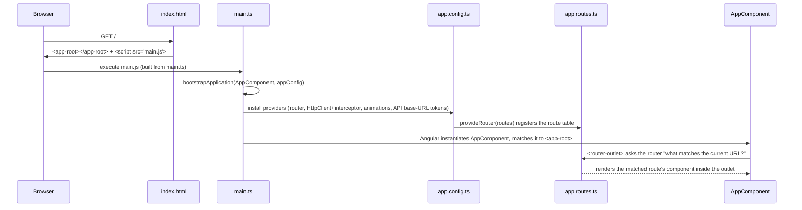

# Eduflex — Frontend Onboarding Walkthrough

> For a developer who is new to Angular and to this repo: how the app actually boots, from the
> HTML file the browser loads to the first pixel on screen — plus how Swagger/NSwag gets wired
> into an Angular project, and where Docker/YAML fit (or currently don't) on the frontend side.
>
> Companion documents: [01-system-architecture.md](01-system-architecture.md) ·
> [04-frontend-design.md](04-frontend-design.md) (component/routing/service reference — this doc
> is the narrative "what happens first, second, third" version of that same material) ·
> [06-configuration-and-endpoints-guide.md](06-configuration-and-endpoints-guide.md)

## 1. The boot sequence, end to end



Each step, in the actual files:

### Step 1 — `src/index.html`: the one static HTML page

```html
<!doctype html>
<html lang="en">
<head>
  <meta charset="utf-8">
  <title>EduflexAngular</title>
  <base href="/">
  <link href="https://fonts.googleapis.com/icon?family=Material+Icons" rel="stylesheet">
  <script src="https://www.google.com/recaptcha/api.js" async defer></script>
</head>
<body>
  <app-root></app-root>
</body>
</html>
```
This is the **only** HTML file the server ever serves as-is (everything else is client-rendered
by Angular, or prerendered at build time — see §6). The one thing that matters mechanically:
`<app-root></app-root>` is a placeholder custom element. Angular fills it in with whatever
component declares `selector: 'app-root'` — that's `AppComponent`, matched in Step 3. The
`<base href="/">` tag is what lets Angular's router use clean URLs (`/staff-portal/applications`)
instead of hash-based ones (`/#/staff-portal/applications`). The reCAPTCHA `<script>` tag is
loaded globally here (not per-component) because the enquiry form needs `grecaptcha` available on
`window` regardless of which route is active.

### Step 2 — `src/main.ts`: the actual entry point

```ts
import $ from 'jquery';
import { bootstrapApplication } from '@angular/platform-browser';
import { AppComponent } from './app/app.component';
import { appConfig } from './app/app.config';

(window as any).$ = $;
(window as any).jQuery = $;

bootstrapApplication(AppComponent, appConfig)
  .catch(err => console.error(err));
```
Three things happen here, in order:
1. **jQuery is imported and manually attached to `window`.** This isn't an Angular idiom — it
   exists because `angular-datatables`/`datatables.net-bs5` (used by `app-data-table`, see
   [04-frontend-design.md](04-frontend-design.md) §6) is a jQuery plugin under the hood and
   expects `window.$`/`window.jQuery` to exist globally, the same way it would in a
   non-module, plain-`<script>`-tag setup.
2. **`AppComponent` is imported from `./app/app.component`** — this is the real root component
   (navbar + router-outlet + footer, see §3). This is worth stating explicitly because there is a
   *second*, similarly-named file, `./app/app` (exporting a class called `App`), which is **not**
   used here — it's leftover Angular-CLI scaffold from the original `ng new`, and it's only
   referenced by the server-rendering entry point (§6) — a genuine inconsistency in this repo, not
   something you did wrong if it seems confusing.
3. **`bootstrapApplication(AppComponent, appConfig)`** hands Angular two things: which component
   to mount at `<app-root>`, and which providers (`appConfig`, from Step 3 below) that component's
   entire component tree gets access to via dependency injection.

### Step 3 — `src/app/app.config.ts`: what gets wired into the DI container

```ts
export const appConfig: ApplicationConfig = {
  providers: [
    provideRouter(routes),
    provideHttpClient(withInterceptors([authInterceptor]), withFetch()),
    provideAnimationsAsync(),
    { provide: APPLICATION_API_BASE_URL, useValue: environment.apiClientUrl },
    { provide: AUTH_API_BASE_URL, useValue: environment.publicApiUrl }
  ]
};
```
Read this as "the list of capabilities every component in this app can `inject()`":
- `provideRouter(routes)` — makes the router work at all, and tells it which route table to use
  (`routes`, imported from `app.routes.ts` — Step 4).
- `provideHttpClient(withInterceptors([authInterceptor]), withFetch())` — makes Angular's
  `HttpClient` injectable everywhere, runs every outgoing request through `authInterceptor` first
  (attaches the JWT — see [04-frontend-design.md](04-frontend-design.md) §4), and uses the
  browser's native `fetch()` under the hood instead of `XMLHttpRequest`.
- `provideAnimationsAsync()` — animation support, loaded lazily so it doesn't bloat the initial
  bundle if nothing on the first screen needs it.
- The two `{ provide: TOKEN, useValue: ... }` lines are **not** Angular framework concepts — they
  exist specifically to feed a URL string into the NSwag-generated API client classes'
  constructors (see §5 below and [04-frontend-design.md](04-frontend-design.md) §2.4 for a real
  gap in this exact mechanism).

### Step 4 — `src/app/app.routes.ts`: the route table

A flat array (full listing and "how to add a route" in
[04-frontend-design.md](04-frontend-design.md) §3). Mechanically, all `provideRouter(routes)`
does is give the router this array to match against `window.location.pathname` every time the URL
changes (including the very first load).

### Step 5 — `src/app/app.component.ts` + `app.component.html`: the real root

```ts
@Component({
  selector: 'app-root',
  standalone: true,
  imports: [CommonModule, RouterOutlet, NavbarComponent, FooterComponent],
  templateUrl: './app.component.html',
})
export class AppComponent {
  constructor(private router: Router) {}
  isPortalRoute(): boolean {
    return this.router.url.startsWith('/student-portal') || this.router.url.startsWith('/staff-portal');
  }
}
```
```html
<!-- app.component.html -->
<app-navbar *ngIf="!isPortalRoute()"></app-navbar>
<router-outlet></router-outlet>
<app-footer></app-footer>
```
This is the component Angular actually mounts into `<app-root>` in Step 1. `<router-outlet>` is
where Step 4's matched route component gets rendered — everything else on the page
(navbar, footer) is static shell around that outlet. `isPortalRoute()` hides the **public** navbar
once you're inside `/student-portal` or `/staff-portal` (the portal has its own navigation via
`HomepageComponent`'s sidebar instead — see [04-frontend-design.md](04-frontend-design.md) §3).

**End state**: browser loaded one HTML file → ran one script → that script told Angular "mount
`AppComponent` here, with these providers" → `AppComponent`'s template has a `<router-outlet>` →
the router (configured via those same providers) looks at the current URL, finds the matching
entry in `app.routes.ts`, and renders that component inside the outlet. Every subsequent
navigation (clicking a link, calling `router.navigate(...)`) repeats only the last step — no full
page reload, no re-running `main.ts`.

## 2. The SSR path is a *different* sequence — know this before touching `app.ts`

Everything in §1 is the **client** (browser) bootstrap, driven by `main.ts`. This app is also
configured for server-side rendering (`outputMode: "static"` in `angular.json`, prerendering at
build time), which has its **own**, separate entry point:

```ts
// main.server.ts
import { App } from './app/app';                  // ⚠ NOT app.component.ts
import { config } from './app/app.config.server';
const bootstrap = (context) => bootstrapApplication(App, config, context);
```

`App` here comes from `src/app/app.ts` — the original, unmodified Angular-CLI scaffold component
(`selector: 'app-root'`, template = a bare `<router-outlet>`, **no navbar, no footer**). So the
HTML Angular prerenders on the server (and what a search engine crawler or a slow first paint
would briefly see before client hydration takes over) does not have the navbar/footer that
`AppComponent` renders — it's a genuinely different component tree than what `main.ts` mounts.
This is flagged as a bug to fix in
[05-findings-and-recommendations.md](05-findings-and-recommendations.md) item 8; it's called out
here specifically because "why are there two files that both look like the app root" is exactly
the kind of thing that's confusing on first read of this codebase, and the answer is "one of them
is dead code that a fix hasn't been applied to yet," not "you're missing something about Angular."
`app.config.server.ts` and `app.routes.server.ts` (which sets `RenderMode.Prerender` for every
route, `**`) are correctly wired and not part of this bug — only the root *component* choice is
wrong.

## 3. How NSwag/Swagger integration actually works here

This repo's setup is **codegen at backend build time**, not a runtime call to fetch a Swagger doc.
Full mechanics (three separate clients, MSBuild trigger chain) are in
[04-frontend-design.md](04-frontend-design.md) §2 and
[01-system-architecture.md](01-system-architecture.md) §6 — this section is the "if you were
setting this up yourself" version, for understanding the shape of the integration rather than
re-deriving every config flag.

The pieces, minimally:
1. **Backend exposes an OpenAPI document.** `Swashbuckle.AspNetCore`'s `AddSwaggerGen` in
   `Program.cs` is what makes `/swagger/{group}/swagger.json` exist at all.
2. **A snapshot of that document is exported to a file** (`dotnet swagger tofile`) — this repo
   does this as an MSBuild step rather than hitting a live URL, so codegen doesn't require the app
   to be running.
3. **NSwag reads that JSON file and emits a TypeScript class** (`nswag run` with a config like
   `nswag.app.json`) — one `Client` class per config, with one method per API operation, typed
   request/response DTOs, and an `@Injectable({ providedIn: 'root' })` decorator so Angular's DI
   can construct it automatically.
4. **The Angular app provides the base URL the generated `Client` needs** via an `InjectionToken`
   — this is the `{ provide: APPLICATION_API_BASE_URL, useValue: environment.apiClientUrl }` line
   in `app.config.ts` (§1, Step 3). Without this, the generated client's constructor
   (`@Optional() @Inject(TOKEN) baseUrl?: string`) falls back to an empty string — which is
   precisely the live bug affecting `content.services.ts` documented in
   [04-frontend-design.md](04-frontend-design.md) §2.4 and
   [05-findings-and-recommendations.md](05-findings-and-recommendations.md) item 5.
5. **A component injects the generated `Client` directly** (constructor DI, like any other
   Angular service) and calls its methods — no hand-written HTTP service layer sits in between
   (see [04-frontend-design.md](04-frontend-design.md) §5).

If you were adding this integration to a brand-new Angular project rather than this one, the
minimum you'd need is: Swashbuckle (or NSwag's own ASP.NET Core middleware) on the backend to
produce an OpenAPI document, the `nswag` CLI (via `NSwag.MSBuild`, `dotnet tool install`, or
`npx nswag`) with a config file pointing `codeGenerators.openApiToTypeScriptClient` at that
document and an output path inside your Angular `src/`, and one `InjectionToken` + provider entry
per generated client so its constructor can resolve a base URL at runtime. Everything past that —
the 3-document split, the MSBuild auto-trigger — is this repo's specific choices, not a
requirement of NSwag itself.

## 4. Docker & YAML on the frontend — current status

There is currently **no Dockerfile inside `eduflex-Angular/`**, even though
`Eduflex/Eduflex/docker-compose.yml` declares an `eduflex-angular` service that tries to build one
(`context: ./eduflex-Angular`, `dockerfile: Dockerfile`) — that compose service would fail to
build today. The real deployed frontend is **not containerized at all**: `frontend-deploy.yml`
runs `npm ci --legacy-peer-deps` then `ng build` and hands the static output straight to Azure
Static Web Apps' own deploy action. Full detail, and what a minimal frontend Dockerfile would look
like if one were ever added, is in
[06-configuration-and-endpoints-guide.md](06-configuration-and-endpoints-guide.md) §6–7 — that
doc also has the from-scratch YAML-syntax explanation (indentation rules, how the backend
Dockerfile and both GitHub Actions workflows are structured) so it isn't duplicated here.
